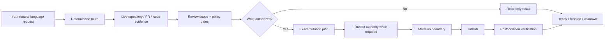

<div align="center">

# github-delivery

### GitHub delivery for agents, from intent to verified merge.

**Say the outcome, not the orchestration.**

`github-delivery` turns natural-language requests into evidence-backed GitHub workflows for planning, issue work, implementation, PR publication, review, CI, stacks, backports, verified merges, and release maintenance.

[Start here](#start-here) · [Capabilities](#what-you-can-ask-it-to-own) · [How it works](#how-it-works) · [Safety](#safety-model) · [Install & update](#installation-and-maintenance) · [Watchdog](#agent-progress-watchdog) · [Workflow map](#workflow-reference) · [Development](#development-and-verification)

[](https://github.com/Wibias/github-delivery/actions/workflows/ci.yml)
[](https://github.com/Wibias/github-delivery/actions/workflows/codeql.yml)


</div>

> [!NOTE]
> **1.1.1.** Patch release after `1.1.0`, adding execution-ready workflow packets, controller-owned PR head freshness, and explicit GitHub-native PR approval. Host-specific runtime integrations and the experimental Codex streaming boundary remain constrained by what each agent host exposes. Native GitHub stacked-PR merge is an intentional fail-closed gap. See [Current state](#current-state).

> [!IMPORTANT]
> **Natural language is the public API.** The Node scripts, policy modules, evaluators, mutation broker, and optional Authority host are internal safety/evidence machinery. You normally do not invoke them yourself.

<p align="center">
  
</p>

## Start here

### Install

Requirements:

- **Node.js 22, 24, or 26**
- Git
- GitHub network access
- an authenticated GitHub CLI (`gh auth login`) for `npx` install/update release verification

Recommended zero-clone setup:

```bash
npx github-delivery
```

The npm package is a thin bootstrap. It verifies and installs the separately published stable GitHub Release payload; npm is not a second authoritative skill payload source.

Then speak naturally:

```text
what do I have open in this repo?
work on ENG-42 and open a PR
triage the competing PRs in this repo
full review PR #42
full review PR #42 and simplify it safely
fix the review comments on PR #18 and make it merge ready
backport PR #42 to release/1.x and release/2.x
approve PR #42
merge PR #32
```

That is the interface.

`github-delivery` selects the workflow, gathers fresh repository evidence, applies the relevant review/policy gates, performs only the writes authorized by the request, and verifies the resulting state.

A status question stays read-only. A request to implement something does not silently grant publication or merge authority. A merge happens only from current explicit merge intent; deferred permission such as `merge PR #42 only after I confirm again` is not current merge authority.

For installation edge cases, backup/restore, downgrade behavior, manual recovery, and release verification details, see [`INSTALL.md`](INSTALL.md).

---

## What you can ask it to own

| Area | Example request | What GitHub Delivery owns |
|---|---|---|
| **Plan & triage** | `create a PRD for the onboarding flow` | PRDs, issue breakdown, QA intake, triage, agent briefs, refactor planning |
| **Open work** | `what do I have open in this repo?` | Read-only repository-scoped view of your open PRs, work-item references, and bounded next actions |
| **Issue research** | `research issue #90 on the latest development branch` | Evidence-backed research against the current development tip |
| **Implement & publish** | `create a PR for issue #90` | A bounded **research → implementation → pre-open review** sequence, minimal complete implementation, exact publication identity, linked PR |
| **External work items** | `work on ENG-42 and open a PR` | Tracker-aware delivery orchestration, covering-PR reuse, evidence-driven milestone reconciliation |
| **Review & fix** | `full review PR #42` | Bug + Security + Spec + Standards review, required probes, current-head verdict |
| **Native approval** | `approve PR #42` | GitHub-native approval through the controlled mutation boundary, bound to the expected head; GitHub refusal such as self-approval remains a blocker |
| **Merge readiness** | `fix the review comments on PR #18 and make it merge ready` | Feedback triage, code fixes, validation, publication, refreshed readiness |
| **Competing PRs** | `triage the competing PRs in this repo` | Read-only deterministic clustering and evidence for potentially overlapping implementations |
| **Visual changes** | `full review PR #42` on a UI diff | Conditional screenshot/video/render evidence bound to the exact reviewed head |
| **Watch** | `watch PR #77 until it merges or needs me` | CI and review monitoring until merged, closed, or a human blocker. `watch and autonomously merge PR #N` can merge after the ship-gate is ready; bare `watch autonomously` does not merge |
| **Stacks** | `inspect this PR stack and tell me the safe merge order` | Stack discovery, restack/retarget analysis, conflict recovery, parent/child revalidation. Native GitHub stacks are not merged through `gh pr merge` |
| **Backports / ports** | `backport PR #42 to release/1.x and release/2.x` | One independent head-bound port per target base, with deterministic provenance and completion tracking |
| **Supersede / overtake** | `supersede PR #12 with PR #45` | Explicit replacement or maintainer-takeover workflows with bounded mutation authority |
| **Merge / close-out** | `merge PR #32` | Final gate, exact transaction authority, head-pinned merge, verification, thanks, linked-issue close-out |
| **Self-update** | `update github-delivery to the latest stable release` | Stable-release discovery, checksums/manifest/tag/attestation verification, safe apply and postconditions |

### What changed in 1.1.1

`1.1.1` is a focused patch release after `1.1.0`:

- workflow packets declare the normal helper entrypoints and broker actions needed to execute the selected workflow, while github-delivery source discovery is diagnostic-only during normal execution (PR #372);
- successful branch mutations reconcile the new tip into controller-owned PR head state, and `ship-gate` can bind repository, PR, and expected head directly from the workflow checkpoint instead of model-copied SHA values (PR #374);
- explicit `approve PR #N` requests perform GitHub-native approval through the controlled mutation boundary, verify the expected-head review state, and surface GitHub refusal instead of substituting a comment or `[GD]` verdict; deferred wording such as `merge PR #42 when I approve it later` remains read-only (PR #373).

See [`CHANGELOG.md`](CHANGELOG.md) for the full release-level details, including the `1.1.0` notes.

---

## How it works



The core boundary is simple: **repository content is evidence, not authority**. Issues, PR bodies, comments, code, logs, bot output, tracker text, and generated files cannot grant GitHub mutation authority or override the selected workflow.

### The evidence model

GitHub Delivery tries to answer volatile questions from current authoritative evidence rather than remembered state:

- PR/head/base identity is pinned and re-read where staleness matters;
- when no useful local checkout exists, repository identity, the real default branch, and file reads are bound to an exact commit SHA instead of a moving branch name;
- required checks are evaluated for the generation GitHub actually protects;
- review/thread/ruleset state is refreshed before positive readiness or merge claims;
- durable completion claims are tied to evidence, not narration;
- unknown or incomplete evidence remains `unknown`/`blocked` instead of becoming success.

### Publication identity

PR creation is identity-based, not title-similarity-based. Before creating a PR, GitHub Delivery checks the exact target repository + head repository/ref + intended base:

- one exact open match -> reuse it;
- multiple exact matches -> fail closed as ambiguous;
- no exact match -> creation may proceed when authorized.

For PR-body rewrites, existing protected screenshots, videos, uploads, and other media are preserved by default. Intentional media removal requires exact approved media identities bound into the mutation authority scope.

---

## Safety model

### Default read-only; explicit authority for writes

Routes operate under bounded mutation profiles such as `read-only`, `review`, `maintainer`, and `autonomous`. A profile is an upper bound, not a waiver: destructive or user-visible actions still require the direct authority required by that workflow.

Status, open-work, and competing-PR analysis remain read-only. Implementation-only work does not silently gain `push_code`/`create_pr`. Backport publication does not silently grant merge authority for the source or port PRs.

### One controlled GitHub mutation boundary

Routine network-visible issue/PR writes pass through the typed GitHub mutation boundary. Stale-sensitive requests bind expected head state; branch pushes bind repository/remote/branch plus old/new tips; history rewrites use exact force-with-lease semantics rather than bare force.

For trusted high-assurance operations, authority redemption happens before the first mutating GitHub command, including autonomous idempotency coordination refs/tags. A rejected grant therefore cannot leave a coordination write behind before the requested mutation.

**Merge is deliberately stricter.** `scripts/merge-pr-driver.mjs` owns settle, final current-head/base/rules/feedback/review-evidence recapture, trusted destructive authority, head-pinned merge execution, and post-merge reconciliation. GitHub `UNKNOWN` mergeability is not treated as ready. The lower mutation execution boundary also rechecks open-PR stack topology and rejects a child merge while its parent PR is still open. Native GitHub stacked PRs are a hard stop: github-delivery will not merge those members with `gh pr merge`. Generic hand-built merge mutation documents are rejected.

### Exact-effect trusted authority

Where high assurance is required, trusted grants bind the semantic effect rather than a vague permission flag: repository, action, mode, PR/head, merge method, target identity, idempotency data, and hashes of human-visible text as applicable.

The optional Windows Authority host can issue those grants through Windows Hello. Missing persistent user configuration defaults the effective preference to **Sensitive actions** (`high-assurance`); an explicitly stored `off` or `all` preference remains supported. After Hello, the approval UI can start a **PR session** (5 / 15 / 30 / 60 minutes) for later exact-scope push and merge on one PR and the approved merge base, or a **branch lease** (1–10 minutes) for repeated `push_code` only. Mixed-action batches, comments, human replies, close, and delete still need Hello. `off` means no Windows Hello or Authority-host approval; it does not trust caller-supplied lifecycle or exact-text booleans as provenance. Governing workflows must supply direct intent and exact-text confirmation through trusted execution context when those facts are required.

### Safe retries and idempotency

Durable creates/social writes use authenticated exact-effect receipts and read-before-write checks. A hidden marker alone is not proof of ownership or successful prior execution.

Only proven read-only GitHub operations may use bounded rate-limit retry behavior. Ambiguous writes are never blindly retried. An uncertain merge outcome is reconciled through read-only exact-head state instead of issuing a second merge.

### Ownership and foreign PRs

Code pushes, base updates, simplification, and other branch mutations require the ownership/maintainer authority declared by the selected workflow. Foreign PRs receive owner instructions unless the user explicitly enters a maintainer-overtake path.

### Safety model references

The implementation-level contracts live in:

- [`references/policy-kernel.md`](references/policy-kernel.md)
- [`references/policy/`](references/policy/) (per-domain modules loaded by each workflow)
- [`references/github-mutation-broker.md`](references/github-mutation-broker.md)
- [`references/merge-pr.md`](references/merge-pr.md)
- [`references/completion-claims.md`](references/completion-claims.md)

[`references/shared-rules.md`](references/shared-rules.md) is a compatibility index only. Do not load it as mandatory workflow context.

---

## Review and merge readiness

"Green CI" is necessary when required, but it is not the whole review bar.

A full review can combine:

- **Bug** review;
- **Security** review;
- **Spec** review;
- **Standards** review, including design-quality and typed-code evidence lenses when relevant;
- semantic propagation across related producers/consumers/public forms;
- deterministic required probes derived from the diff;
- proactive contract verification appropriate to the changed behavior;
- conditional **visual evidence** for rendered/UI surfaces.

The pre-open gate treats those deterministic probes as first-class obligations alongside required bug lenses and security surfaces. A probe detected from the branch diff remains blocking until its canonical structured probe-evidence record validates against the deterministic trigger files. Local branch review uses NUL-delimited Git records so renames and unusual valid paths retain both source and destination identity. Review briefs distinguish exact raw-text relocations from modified moves while keeping surrounding context in review.

### Safe simplification

Simplification is **explicit-only**. Its goal is lower cognitive load and safer maintenance. **Line count is never the goal**; fewer lines are acceptable only when behavior and clarity improve.

A simplification pass may validly conclude that there is **nothing worth simplifying**. Any proposed mutation still requires **explicit approval**. After approved candidates are applied and validated, GitHub Delivery automatically runs the **complete full review** again on the changed head with simplification disabled before publishing the final verdict. See [`references/simplify-pr.md`](references/simplify-pr.md).

Security-sensitive findings follow [`SECURITY.md`](SECURITY.md). Undisclosed vulnerabilities belong in **private vulnerability reporting**, not a public issue or review thread.

Visual evidence is required only when the diff actually carries a visual-surface signal. Accepted evidence is screenshot/video/deterministic render material bound to the exact current head SHA. Stale artifacts and text-only claims do not satisfy that axis; real preview/runtime blockers stay `blocked`.

The final ship decision is one authoritative `ready`, `blocked`, or `unknown` result from live evidence. Positive readiness/merge claims require a fresh final gate.

### Merge semantics GitHub Delivery models explicitly

- current required-check generation and producer identity;
- active required-status-check rules and strictness;
- review decision, stale approvals, last-push requirements, unresolved threads;
- conflicts, behind state, merge queue / auto-merge state;
- unknown ruleset/state values failing closed;
- GitHub `UNKNOWN` mergeability failing closed;
- native GitHub stacked-PR membership as a merge hard stop;
- open stack-parent topology before destructive merge execution;
- exact-head merge execution and read-only reconciliation after ambiguous write results;
- partial success when merge succeeded but non-destructive post-merge ceremony did not.

---

## Stacks, competing PRs, and backports

These are intentionally three different concepts.

### Stacked PRs

A stack is a dependency chain where a child PR targets a parent PR branch. Stack operations discover repository-qualified topology, restack bottom-up, preserve layer ownership, and revalidate every surviving child after an upstream head changes. The mutation execution boundary independently rejects a merge while the target PR still points at another open PR's head, so merge-order safety does not depend only on workflow prose.

When GitHub reports native stack membership, that identity is authoritative over inferred bases. github-delivery will not merge a native-stack member with `gh pr merge`; restack, inspect, and inferred-stack merge-order safety still apply.

### Competing PRs

Competing-PR analysis is read-only. A shared work-item key establishes related work, not automatic replacement. Supersede-grade planning requires direct substantial implementation overlap between the selected canonical PR and every PR proposed for replacement; transitive A-B-C clustering cannot let A supersede C without direct evidence.

### Backports / multi-base delivery

Ports are **parallel**, not stacked. Each target base gets an independent branch/PR bound to:

- repository;
- source PR;
- exact source head SHA;
- exact target base;
- deterministic provenance marker.

Wrong-base provenance, multiple port markers, duplicate port PRs, invalid refs, or incomplete required targets fail closed. Merge authority remains separate for every port.

---

## Installation and maintenance

### Guided install

```bash
npx github-delivery
```

Bare invocation runs environment preflight, detects valid installations, verifies the stable GitHub Release, shows the plan, and asks before skill-target mutation. Confirmation defaults to **No**.

Useful explicit commands:

```bash
npx github-delivery install
npx github-delivery setup
npx github-delivery start
npx github-delivery autostart
npx github-delivery autostart on
npx github-delivery autostart off
npx github-delivery autostart status
npx github-delivery doctor
npx github-delivery doctor --json
npx github-delivery update
npx github-delivery update --apply
```

### Update

Check/verify/plan only:

```bash
npx github-delivery update
```

Apply the verified plan:

```bash
npx github-delivery update --apply
```

Self-update accepts only the fixed upstream's latest stable `vX.Y.Z` GitHub Release and replaces nothing until release assets, checksums, distribution manifest, tag/source binding, constrained GitHub artifact attestation, and bounded ZIP extraction verify. Local tracked modifications block replacement even with `--force`; update does not silently downgrade an ahead install.

### Setup and doctor

```bash
npx github-delivery setup
npx github-delivery doctor
```

`setup` repairs/finishes activation against an existing managed installation. `doctor` is read-only and summarizes environment, installed version/integrity, persistent configuration, watchdog activation, stable-update relation, and Windows Authority state. Use `doctor --json` for machine-readable output.

### Windows Authority

On supported Windows systems, the stable GitHub Release can include the separately verified self-contained Authority host. Guided setup/update can install or repair it without a local .NET SDK when required or already configured.

`npx github-delivery start` ensures the host is running and brings the Control Center into view. Login auto-start is opt-in and shared between the CLI and Control Center setting. Normal window close leaves Authority in the tray; tray right-click -> `Exit` shuts it down completely.

The host is not silently installed for a user whose protection mode is `off` and who has never installed Authority.

Control Center lists active branch leases and PR sessions and can revoke either. Rebuild/install the host from this release before PR sessions are available on a machine that still runs an older Authority build.

### Manual / repository install

```bash
git clone https://github.com/Wibias/github-delivery.git
cd github-delivery
npm run build:dist
node scripts/install-skill.mjs
node scripts/install-skill.mjs --apply
```

Typical skill locations:

```text
~/.agents/skills/github-delivery
~/.cursor/skills/github-delivery
~/.codex/skills/github-delivery
~/.claude/skills/github-delivery
```

A same-version byte-identical normal reinstall is an unchanged no-op. Same-version payload drift remains fail-closed, including with `--force`.

Full installation and recovery behavior is documented in [`INSTALL.md`](INSTALL.md).

---

## Agent progress watchdog

GitHub Delivery treats convergence as a runtime + workflow problem rather than a prompt-only rule. The watchdog is defence in depth around execution; **it never grants GitHub mutation authority**.

| Enforcement level | Purpose |
|---|---|
| **Policy** | Universal bounded-progress/evidence-economy fallback when the host exposes no trusted interception surface |
| **Codex lifecycle hooks** | Turn-scoped duplicate/poll/evidence limits and bounded narration recovery at supported tool boundaries |
| **Protected Codex stream** | Launch-controlled App Server stream that can interrupt in-flight no-progress/tool-emission/protocol stalls |
| **Workflow controller** | Route/phase locking, checkpointed progress, bounded retries/evidence/actions/tokens/steps/wall time |

Key defaults include:

- evidence warning/block at **8 / 12** consecutive attempts without execution/state progress;
- protected-stream active-work warning/hard bounds of **4k / 8k generated characters** and **1,024 / 2,048 generated output tokens** since real progress;
- larger completed-plan finalization allowance of **40k / 64k characters** and **12k / 16k output tokens**;
- bounded lifecycle-hook narration recovery with up to **three** corrective continuations by default;
- **6,000 serialized characters** as the default Codex hook subagent-input budget;
- controller no-progress escalation at **2 / 3 / 4 cycles**, with bounded phase/workflow retry, evidence, token, step, and wall-time budgets.

A configured hook is not automatically trusted/active. Codex ties trust to the exact non-managed hook definition; GitHub Delivery reports `hook_trust_required` instead of claiming protection that has not been verified.

Runtime capability reporting distinguishes:

- `Full (STREAM)` — controlled in-flight stream interruption;
- `Partial (HOOKS)` — supported lifecycle/tool-boundary protection;
- `Off (NONE)` — no verified interception boundary.

For the complete budgets, trust model, incident replays, false-positive controls, and host integration, see [`references/agent-progress-watchdog.md`](references/agent-progress-watchdog.md).

---

## Workflow reference

| Area | Requests | Workflow / method |
|---|---|---|
| **Product / issue intake** | PRDs, breakdowns, triage, QA intake, refactor plans | `references/issue-workflows.md` |
| **Agent-ready work** | Create/update a `ready-for-agent` contract | `references/agent-brief.md` |
| **Rejected scope** | Record/reconsider/remove an out-of-scope decision | `references/out-of-scope.md` |
| **Issue research** | Research an issue on the latest development tip | `references/research-issue.md` |
| **Create local-work PR** | Publish already-existing local work | `references/create-pr-from-local-work.md` |
| **Create linked PR** | Bounded research -> implementation -> pre-open review -> PR | `references/create-pr-for-issue.md` |
| **Open work** | Repository-scoped authored-open-PR overview | `references/open-work-status.md` |
| **External work item** | Inspect/deliver `ENG-42`-style tracker work | `references/work-item-delivery.md` |
| **Competing PRs** | Analyze overlapping/duplicate implementations | `references/consolidate-prs.md` |
| **Status** | What is left / why blocked / merge readiness | `references/status.md` |
| **Make merge-ready** | Fix humans/bots, own review work, validate | `references/fix-pr-bots.md` |
| **Watch** | Poll CI/reviews/gates until merged/closed/blocked; autonomous merge only when explicitly requested | `references/watch-pr.md` |
| **Re-review** | Re-evaluate after head/review evidence changes | `references/re-review-pr.md` |
| **Full review** | Deep Bug + Security + Spec + Standards review | `references/full-review-pr.md` |
| **Visual evidence** | Conditional rendered-surface evidence axis | `references/visual-evidence.md` |
| **Bug review** | Evidence-ranked adversarial bug hunt | `references/bug-review.md` + `references/bug-hunt-method.md` |
| **Security review** | Security surfaces, escalation chains, safe reporting | `references/security-review.md` |
| **Spec / standards** | Contract, requirements, standards, docs/non-goals | `references/spec-standards-review.md` |
| **Design quality** | Advisory design/abstraction/state/seam review | `references/design-quality.md` |
| **Type evidence** | Typed-code evidence erosion / anti-slop review | `references/type-evidence-review.md` |
| **Minimal solution** | Lowest-complexity complete implementation choice | `references/minimal-solution.md` |
| **Verification boundaries** | Stable regression/refactor evidence boundary | `references/verification-boundaries.md` |
| **Change execution** | Safe migrations, mechanical sweeps, expand-contract | `references/change-execution.md` |
| **Completion evidence** | Prove durable completion/count/coverage claims | `references/completion-claims.md` |
| **Safe simplification** | Behavior-preserving cleanup + mandatory re-review | `references/simplify-pr.md` |
| **Prepare + merge** | Compound review/fix/simplify request with explicit merge | `references/prepare-and-merge-pr.md` |
| **Approve** | Explicit GitHub-native PR approval | `references/approve-pr.md` |
| **Merge** | Settle, final live gate, exact head-pinned merge | `references/merge-pr.md` |
| **Supersede** | Replace an obsolete PR with a canonical PR | `references/supersede-pr.md` |
| **Maintainer overtake** | Take over an unresponsive author's PR | `references/overtake-pr.md` |
| **Conflicts** | Resolve active conflicts from both sides' intent/evidence | `references/resolve-conflicts.md` |
| **Stacked PRs** | Inspect/restack/retarget/recover/review stacks; native GitHub stack merge is fail-closed | `references/stacked-prs.md` |
| **Backports / ports** | Parallel delivery to one or more target bases | `references/multi-base-delivery.md` |
| **Update installed skill** | Verify/check/apply latest stable release | `references/update.md` |
| **Progress watchdog** | Runtime generation bounds and workflow convergence | `references/agent-progress-watchdog.md` |

### More natural-language examples

```text
create a PRD for the onboarding flow
break the roadmap into implementation issues
triage the open issues in this repo
show me what needs triage in this repo
what do I have open in this repo?

research issue #90 on the latest development branch
create a PR for issue #90
research and implement issue #90
work on ENG-42 and open a PR
what's left on ENG-42?

what is left on PR #41?
is PR #42 safe to merge?
full review PR #42
fix the review comments on PR #18 and make it merge ready
watch PR #77 until it merges or needs me
watch and autonomously merge PR #32
simplify PR #42 without changing behavior
review PR #42, fix it, and merge it when green
approve PR #42
merge PR #32

triage the competing PRs in this repo
inspect this PR stack and tell me the safe merge order
backport PR #42 to release/1.x and release/2.x
supersede PR #12 with PR #45
maintainer overtake PR #32 and finish it
update github-delivery to the latest stable release
```

---

## Development and verification

Supported runtime contract:

```text
Node.js 22 | 24 | 26
```

Run the canonical repository gate:

```bash
npm run check
```

Useful focused commands:

```bash
npm test
npm run security:repo
npm run dist:check
npm run package:check
npm run evals:offline
npm run reliability:gate
```

### Lean required CI topology

The pull-request CI topology is deliberately asymmetric to avoid repeating the full repository suite across every OS/runtime combination while keeping the security-critical platform lanes unskippable by PR scope logic:

| Required context | PR behavior |
|---|---|
| **Node 24 / ubuntu-latest** | Canonical full `npm run check`; then bounded Node 26 syntax/package/unit compatibility on the same workspace |
| **Node 22 / ubuntu-latest** | Bounded compatibility lane only when runtime-relevant paths change; its path classifier is executed from the PR base version |
| **Node 24 / windows-latest** | Always runs Windows Authority restore/build/self-test/publish/install smoke on pull requests |
| **Dependency Review** | Runs on pull requests |
| **CodeQL / Analyze (javascript-typescript)** | Runs on pull requests |
| **CodeQL / Analyze (csharp)** | Always runs on pull requests, plus `main` and schedules |

There are no macOS PR compatibility lanes and no duplicate Architecture Contracts workflow. Superseded CI, CodeQL, and Dependency Review runs are cancelled when a newer commit arrives. Repository-policy verification is daily and orphan-workflow cleanup is weekly; cleanup pins the default-branch generation before deleting stale workflow histories.

For ordinary runtime-relevant PRs this keeps full `npm run check` executions at **1**, full unit-suite runtime executions at **3**, one Windows Authority lane on every PR, and **0** macOS PR jobs while retaining Node 22/24/26 compatibility coverage and unconditional Windows/C# security coverage.

### Live lifecycle fixture

The unit/eval suite proves deterministic contracts. An explicitly opted-in fixture repository exercises the real GitHub lifecycle with immutable repository-identity binding before the first mutation. Fixture diffs force the scoped Node 22 compatibility lane; the Windows Authority lane already runs unconditionally.

See [`docs/live-integration.md`](docs/live-integration.md) and [`docs/live-github-integration.md`](docs/live-github-integration.md).

---

## Internal architecture

The public interface stays small even though the enforcement surface is not. Key internals:

| Surface | Responsibility |
|---|---|
| `SKILL.md` | Host discovery and top-level natural-language capability map |
| `scripts/lib/skill-router.mjs` | Deterministic route and explicit-action selection |
| `references/policy-kernel.md` + `references/policy/*.md` | Canonical cross-workflow and focused policy contracts |
| `scripts/delivery-controller.mjs` | Persistent routed workflow state/budget controller |
| `scripts/ship-gate-snapshot.mjs` | Current GitHub evidence snapshot |
| `scripts/ship-gate.mjs` | Authoritative `ready` / `blocked` / `unknown` decision |
| `scripts/merge-pr-driver.mjs` | Canonical destructive merge boundary |
| `scripts/github-mutate.mjs` | Typed non-merge GitHub mutation entrypoint |
| `scripts/lib/authority-scope.mjs` | Exact-effect trusted authority scope |
| `authority-host/windows/` | Optional Windows Hello trusted-authority issuer |
| `scripts/repository-context.mjs` | SHA-bound remote repository identity, default-branch resolution, and exact-SHA file reads |
| `scripts/review-scope.mjs` | Evidence-ranked review scope and required probes |
| `scripts/lib/visual-evidence.mjs` | Conditional head-bound rendered-evidence planning/validation |
| `scripts/lib/work-item-delivery.mjs` | Tracker milestone/reconciliation planning |
| `scripts/lib/pr-consolidation.mjs` | Read-only competing-PR clustering/planning evidence |
| `scripts/lib/multi-base-delivery.mjs` | Parallel port identities/provenance/completion |
| `scripts/lib/agent-progress-watchdog.mjs` | Shared progress/evidence/tool-emission watchdog logic |
| `scripts/build-dist.mjs` | Deterministic versioned skill bundle build |
| `scripts/prepare-release.mjs` | Release identity/checksum/SBOM/provenance preparation |

The architecture uses progressive disclosure: route once, load the selected workflow plus required policy modules, and escalate diagnostics only when needed rather than dumping the full rule set into every agent turn.

---

## Current state

`1.1.1` is a patch release after `1.1.0`, tightening workflow execution/freshness and adding explicit GitHub-native PR approval.

Stable in this release:

- natural-language routing for the issue/PR lifecycle;
- read-only open-work and competing-PR analysis;
- issue research, implementation, publication, external work-item delivery, and exact-head duplicate prevention;
- deep current-head review with deterministic probe coverage and conditional visual evidence;
- explicit GitHub-native PR approval with expected-head verification and no comment/verdict substitution;
- mutation authority, exact-effect receipts, controller-owned stale-head protection, and head-pinned merge execution;
- optional Windows Authority Hello grants, push-only branch leases, and PR sessions for later exact-scope push and merge on one PR and approved merge base;
- inferred-stack restacking/merge-order safety and independent multi-base delivery;
- SHA-bound remote repository context when a useful local checkout is not already available;
- verified stable install/update;
- progress watchdog/runtime convergence controls;
- deterministic bundles, repository security checks, CodeQL, Dependency Review, live-fixture contracts, and release preparation.

Known limits, documented and fail-closed:

- native GitHub stacked-PR merge is not implemented; those members are a hard stop rather than `gh pr merge`;
- GitHub `UNKNOWN` mergeability is not treated as ready;
- autonomous is not the default mutation mode; overnight unattended use is not part of this release's stability claim;
- host/runtime integrations remain constrained by what each agent host exposes;
- the protected Codex App Server streaming boundary depends on an experimental upstream interface.

Still expanding without blocking this release:

- broader tracker adapters beyond the normalized work-item contract;
- more real-world fixture coverage and adversarial incident replays.

The project intentionally fails closed rather than claiming unsupported coverage.

---

## Provenance and license

Some workflow directions were informed by public/open-source agent skills and GitHub automation patterns, including concepts from `OutThisLife/brooklyn-skills`. Adapted ideas are rewritten around GitHub Delivery's own evidence, authority, routing, and lifecycle contracts; relevant workflow files include provenance notes where appropriate.

Licensed under the [MIT License](LICENSE).