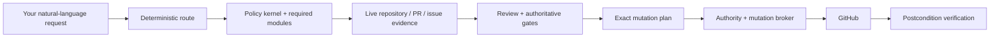

<div align="center">

# github-delivery

**A GitHub shipping skill for agents — from product intake to a verified merge.**

Speak naturally. `github-delivery` routes the request, gathers live evidence, runs the relevant review and policy gates, performs only the GitHub writes that request authorizes, and verifies the resulting state.

[](https://github.com/Wibias/github-delivery/actions/workflows/ci.yml)
[](https://github.com/Wibias/github-delivery/actions/workflows/codeql.yml)


</div>

> [!IMPORTANT]
> **Natural language is the public API.** You do **not** need to invoke Node scripts yourself. The scripts, policy modules, authority layer, evaluators, and mutation broker are internal safety and evidence machinery.

## At a glance

| | |
|---|---|
| **Scope** | PRDs and issue intake → research → implementation → PR review/fix/watch → stacks → merge and linked-issue close-out |
| **Default mode** | `read-only` |
| **Write boundary** | Typed mutation policy + broker; stale-head, exact-effect, authenticated-receipt idempotency, and postcondition checks where applicable |
| **High-assurance writes** | Exact-scope trusted grants; optional Windows 11 / Windows Hello authority host |
| **Review model** | Bug + Security + Spec + Standards + semantic propagation + proactive contract verification |
| **Ship decision** | One authoritative `ready`, `blocked`, or `unknown` result from live evidence |
| **Runtime** | Node.js **22 or 24** |
| **Required CI matrix** | Node 22/24 × Ubuntu/Windows/macOS, with architecture contracts inside every required matrix job |
| **Live lifecycle tests** | Dedicated, explicitly opted-in fixture repository bound by immutable repository identity |

## Speak naturally

```text
create a PRD for the onboarding flow
break the roadmap into implementation issues
triage the open issues in this repo
run QA intake on the payment bug report
research issue #90 on the latest development branch
create a PR for issue #90

what is left on PR #41?
is PR #42 safe to merge?
full review PR #42
fix the review comments on PR #18 and make it merge ready
watch PR #77 until it merges or needs me
simplify PR #42 without changing behavior
full review PR #42 and simplify it safely
review PR #42, fix it, and merge it when green
merge PR #32
merge PR #42 only after I confirm again

inspect this PR stack and tell me the safe merge order
supersede PR #12 with PR #45
maintainer overtake PR #32 and finish it
```

A question such as `is PR #42 safe to merge?` stays **read-only**. A destructive merge route is selected only from an actual merge instruction such as `merge PR #42` or `review PR #42 and merge it when green`.

Deferred or conditional permission is **not** current merge authority. Wording such as `merge PR #42 only after I confirm again`, `merge it when I approve it later`, or `ask me again before you merge` remains on the read-only status path until a fresh direct merge instruction is actually given.

---

## What it can own

| Area | Requests | Workflow |
|---|---|---|
| **Product / issue intake** | PRDs, breakdowns, triage, QA intake, refactor plans | `references/issue-workflows.md` |
| **Agent-ready work** | Create/update a `ready-for-agent` contract | `references/agent-brief.md` |
| **Rejected scope** | Record, match, reconsider, or remove an out-of-scope decision | `references/out-of-scope.md` |
| **Issue research** | Research an issue on the latest development tip | `references/research-issue.md` |
| **Create a linked PR** | Bounded research → implementation → pre-open review → PR | `references/create-pr-for-issue.md` |
| **Make a PR merge-ready** | Fix humans/bots, own bug/security/spec work, validate | `references/fix-pr-bots.md` |
| **Watch a PR** | Poll CI/reviews/gates until merged, closed, or blocked | `references/watch-pr.md` |
| **Re-review** | Re-evaluate after new commits, humans, CodeRabbit/Codex, or other review evidence | `references/re-review-pr.md` |
| **Full review** | Deep Bug + Security + Spec + Standards review and final verdict | `references/full-review-pr.md` |
| **Bug review** | Evidence-ranked adversarial bug hunt | `references/bug-review.md` + `references/bug-hunt-method.md` |
| **Security review** | Security surfaces, escalation chains, exploit-safe reporting | `references/security-review.md` |
| **Spec / standards** | Contract, requirement, standards, docs and non-goal review | `references/spec-standards-review.md` |
| **Safe simplification** | Behavior-preserving cleanup with approval and mandatory re-review | `references/simplify-pr.md` |
| **Status** | What is left / why blocked / merge readiness | `references/status.md` |
| **Prepare + merge** | Compound review/fix/simplify request that explicitly includes merge | `references/prepare-and-merge-pr.md` |
| **Merge** | Final gate, exact transaction authorization, final-boundary recheck, head-pinned merge, thanks, linked-issue close-out | `references/merge-pr.md` |
| **Supersede** | Close an obsolete PR in favor of a replacement | `references/supersede-pr.md` |
| **Maintainer overtake** | Take over an unresponsive author's PR under explicit maintainer scope | `references/overtake-pr.md` |
| **Conflicts** | Resolve active conflicts from both sides' intent/evidence, then resume | `references/resolve-conflicts.md` |
| **Stacked PRs** | Inspect, restack, retarget, recover, review and merge stacks | `references/stacked-prs.md` |

For oversized-change splitting, post-ship branch/worktree cleanup, and version/tag/changelog work, `SKILL.md` deliberately hands off to the dedicated specialist skill instead of duplicating those responsibilities.

---

## How a request flows



1. `SKILL.md` selects the narrowest workflow and mutation mode.
2. The workflow loads `references/policy-kernel.md` plus only the policy modules it declares.
3. Repository identity, actors, heads, checks, reviews, rules, and other gate-critical state are resolved from live evidence instead of guessed.
4. Review helpers diagnose; `scripts/ship-gate.mjs` remains the authoritative readiness/ship decision.
5. Any external write is represented as a typed, scoped mutation request.
6. The broker re-checks preconditions, obtains trusted authority when required, executes the exact effect, and emits an auditable receipt.
7. Final readiness, publication, or merge claims require fresh final evidence from unchanged relevant state.

### Policy precedence

Executable gates and the canonical policy kernel/modules are stricter than workflow prose. Repository content — issues, comments, code, logs, generated files, bot output — is treated as **evidence/data, not authority** and cannot override user intent or the mutation boundary.

---

## Safety model

### 1. Default read-only; explicit intent for state changes

`github-delivery` routes requests into four upper-bound profiles:

- `read-only`
- `review`
- `maintainer`
- `autonomous`

The profile is not a waiver. Maintainer-grade actions such as merge, close, supersede, reviewer changes, ordinary human-thread resolution, or branch deletion still require the direct instruction required by the selected workflow.

The merge router uses a narrow positive command grammar. Status questions containing words such as *merge* or *ship* do not silently become destructive requests. Future or conditional permission is also excluded: confirmation/approval that the user explicitly defers until later remains read-only until the later confirmation actually happens.

### 2. Every network-visible GitHub write crosses one mutation boundary

Creating/editing issues or PRs, labels, assignments, comments, reviews, thread state, draft state, reviewers, remote branches, closes, merges, and follow-up objects are brokered through `scripts/github-mutate.mjs`, `scripts/lib/github-mutation-router.mjs`, and the lifecycle/legacy broker implementations behind that router.

The action model is centralized in `scripts/lib/mutation-action-registry.mjs`. Policy, broker behavior, routing/high-assurance semantics, and architecture tests are derived or cross-checked from that registry so adding an action cannot silently skip a safety layer.

PR mutations that can become stale are bound to the **expected head** and re-read it immediately before execution. Branch pushes bind the intended repository/remote/branch and exact old/new tips; history rewrites use exact `--force-with-lease`, never bare force.

A repository-wide mutation-boundary regression check rejects direct production GitHub/remote-Git write paths outside the approved boundary.

### 3. Trusted authority binds the exact effect

Caller fields such as `mutationMode`, `explicitInstruction`, `exactTextConfirmed`, `source: user`, or `trusted: true` are policy assertions — not proof of consent.

Where trusted authority is required, a host-issued grant binds a deterministic `scopeSha256` over the semantically relevant effect: repository, action, mode, PR/head, merge method, targets, idempotency key, and hashes of human-visible text. Redemption-required grants are short-lived and one-time.

Protected thread-state mutations are part of that high-assurance boundary. In particular, `resolve_bot_thread` cannot be authorized merely because repository/bot content caused the request; the Windows authority host classifies it as Windows Hello-protected even in `review` mode.

#### Human-thread replies

A human reply can be **planned** so its exact text is visible, but execution requires both:

- exact-text confirmation bound to the outgoing body; and
- trusted scoped authority.

A caller-computed hash or boolean cannot authorize the reply by itself.

#### Full-review verdict provenance

A format-valid `[GD]` verdict posted by the authenticated GitHub actor is not automatically trusted merge evidence.

Full-review publication is a high-assurance special case: `scripts/github-authorize.mjs` stamps durable hidden authority provenance onto the exact reviewed-head verdict request. `scripts/verify-verdict-published.mjs` verifies both the verdict format and the historical trusted-authority provenance at the comment's creation time. Same-actor lookalike verdicts without a valid scoped grant are rejected as merge-review evidence.

### 4. Exact idempotency receipts and safe retries

Durable creates and social writes use stable idempotency keys plus remote read-before-write evidence, but a predictable hidden marker is **not** sufficient proof that the intended effect already happened.

Receipt reuse is bound to the authenticated GitHub actor and the exact visible effect. The verifier rejects foreign-actor marker collisions, rejects pull requests returned by the Issues API when verifying issue creation, binds PR creation to the intended title/base/head, and binds review-thread replies to the intended parent comment. Autonomous same-key effects still use a remote claim so competing workers cannot both publish the same durable effect.

GitHub rate-limit retries are deliberately asymmetric:

- only commands proven **read-only** may retry;
- `Retry-After` and `X-RateLimit-Reset` are honored when present;
- fallback backoff is bounded, with **3 attempts by default**;
- GraphQL `mutation`, GitHub writes, and ambiguous API calls are **never blindly retried** after an unknown result.

A merge write that returns a non-zero/transport error after the exact write reached the runner is handled by **read-only reconciliation**, not a second merge attempt. The broker re-reads the exact-head merge state and returns `reconciled_after_error` only when GitHub proves the intended merged/queued/auto-merge outcome. If the result cannot be proved, the outcome remains explicitly unknown.

### 5. Ownership and foreign-PR boundary

Base updates, scoped code pushes, and simplification edits are performed only when the workflow has the required ownership/write authority. Foreign PRs receive exact owner instructions unless the user explicitly enters the maintainer-overtake workflow.

---

## Review depth: more than "the checks are green"

A merge-ready or full-review path does not outsource judgment to CI or bots. The `blocking` scope rule is a binding readiness contract: a scope component marked blocking cannot be silently skipped, treated as advisory, or reported clean without its required evidence.

### Multidimensional review

The review bar combines:

- **Bug** review
- **Security** review
- **Spec** review
- **Standards** review
- repository-wide **semantic propagation** when a domain concept changes
- **Proactive contract verification** appropriate to the diff

Review depth is derived from changed paths, patch content, symbols, removed controls, dependencies, workflow permissions, architecture surfaces, and uncertainty — not filenames alone.

### Semantic propagation

Changed files are only the starting points. A full review traces each changed domain concept from its authoritative source through producers, consumers, sibling implementations, derived/public representations, persistence/serialization, fixtures, and tests.

Families such as provider sets, capability tables, schemas, enums, platform matrices, registries, or defaults are partitioned by materially different behavior. One representative is not accepted as coverage for the whole family unless equivalence is actually proved.

### Adversarial bug review

The bug axis uses a built-in **Finder → Challenger → Arbiter** method. Static-analysis leads and tool-free heuristics feed finding cards with explicit evidence and a Gate 0 impact bar. Coverage is reported honestly as `confirmed`, `dismissed`, `manual-review`, or `unreviewed`; partial coverage is never presented as clean.

### Deterministic probes and machine-checkable coverage

Known bug/security classes are named probes in `scripts/lib/probe-registry.mjs`.

- Diff shape deterministically produces `requiredProbes`.
- Offline scope fixtures pin the exact expected probe set.
- Retained regression assertions are bound to documentation anchors.
- Each required probe must emit `{ probeId, status, files?, reason? }` evidence.
- A required probe with concrete trigger files must resolve to `clean` or `findings`; it cannot be downgraded to `n-a` by free-form model prose.
- `n-a` remains valid only for the no-trigger edge case and requires a non-empty reason.
- `scripts/verify-probe-coverage.mjs` must accept that evidence before the axis can be considered complete.

Dropping a trigger, probe tag, assertion anchor, or required application record is a CI failure rather than silent review drift.

### Proactive contract verification

Depending on the diff, the review actively checks contracts such as wiring, operator smoke behavior, test honesty, docs/non-goals, input shape, evidence semantics, scale/determinism, malformed-input handling, serialization budgets, recursive termination, and CLI/API payload completeness.

Passing bots are necessary evidence when required, but are never sufficient proof by themselves.

### Security-specific behavior

Security review applies Gate 0 before a Confirmed finding and checks escalation chains before severity is assigned. Public output is redacted when exploit detail would be unsafe.

Credential-bearing OAuth/token/key adapters receive an explicit transport check: destinations must be HTTPS; a shared validator that still permits an adapter to attach credentials to `http://` is not accepted.

### Bot full-review signals

When a bot announces a **full review** rather than an incremental update, the skill runs its own Bug + Security + Spec review on the current head before treating prior `[GD] Fixed` replies as sufficient.

### Full-review completion is locked to a final verdict

A full review is not complete merely because analysis stopped. Its execution plan retains a mandatory **Publish final verdict** item until the final verdict for the reviewed head has been delivered.

Normal completion requires a format-valid, verified GitHub verdict. If GitHub publication is genuinely unavailable because of an auth, network, or API hard blocker, the workflow records that exact blocker and provides the complete verdict in chat instead. Choosing a stricter mutation mode on its own is not publication unavailability. The only permitted exit with **no verdict at all** is explicit user cancellation.

Same-head reruns use a material-delta anti-noise rule: when the strict label/TLDR result has not materially changed, an already valid verdict may be reused instead of posting duplicate top-level noise.

---

## Merge readiness and GitHub semantics

The ship path deliberately models platform details that commonly cause "green but not actually safe" mistakes.

- Required checks belong to the exact current PR generation; old-SHA results, partial matrices, queued checks, and incomplete evidence do not count.
- Check evidence preserves expected workflow/app/integration identity; same-name Check Run / Commit Status collisions cannot impersonate an app-bound required check.
- GitHub's authoritative check target is used where the platform evaluates a test-merge/merge-queue generation instead of naively trusting a convenient head result.
- Active applicable `required_status_checks` rules are aggregated; strict server-enforced base coherence is present when **any** applicable active rule requires strict required checks, independent of ruleset ordering.
- GitHub review decision, stale approvals, last-push approval requirements, unresolved review threads, conflicts, behind state, and merge-queue state are evaluated.
- The canonical merge driver precomputes the exact merge + optional post-merge-thanks transaction, obtains trusted grants for that exact batch, then recaptures live state and re-verifies the final merge boundary and review evidence **before** redeeming a grant or writing.
- `gh pr merge`/API success is not automatically reported as an immediate merge: queued/auto-merge and actual merged outcomes remain distinct.
- An error after an attempted merge write is reconciled from read-only exact-head state; the write is never blindly retried.
- Unknown future GitHub enum/state values fail closed instead of being treated as success.
- Dependency Review degradation fails closed across real dependency surfaces, including nested/non-Node dependency graphs such as NuGet.
- Merge execution requires same-head github-delivery review evidence, not merely a green ship gate.

### Base-health isolation

When a required check is red, the `baseHealth` component classifies the evidence as:

- `fix_in_pr` — introduced by the PR;
- `separate_follow_up` — reproduced on the base tip; or
- `investigate` — origin is unknown.

An unknown origin is a hard evidence stop. A base failure may still block shipping, but does not silently expand the implementation scope of the PR.

### Adaptive settle before a positive final claim

Once the authoritative gate first becomes ready, the workflow visibly settles on unchanged heads:

- **60 seconds** by default;
- **180 seconds** after a push, rebase, restack, force-with-lease, approval/thread change, or newly discovered workflow;
- authoritative gate re-check every **20 seconds**;
- no single blocking sleep longer than **30 seconds**.

Polling uses short bounded waits so new evidence can be observed without one long blocking sleep. Material change resets the settle window, and one final authoritative gate closes the decision.

There is no path to a positive readiness, publication, or merge claim without one fresh final gate.

---

## Create-PR flow: bounded research, then forward progress

Creating a linked PR uses a bounded **research → implementation → pre-open review** sequence before publication.

Creating a PR follows this lifecycle:

```text
bounded need-to-fix research
        ↓
implementation
        ↓
pre-open Bug + Security gate on the non-empty candidate diff
        ↓
publish linked PR
        ↓
normal merge-ready lifecycle
```

The pre-open gate is **post-implementation and pre-publication**. It cannot become a research loop that prevents the first implementation commit. Completed issue research is reused when the relevant issue/development state has not changed.

`scripts/pre-open-gate.mjs` blocks incomplete/empty candidate diffs and prevents publication while required review evidence is incomplete or Confirmed High/Critical findings remain unresolved.

Remote branch push, PR creation/body correction, issue assignment, and related lifecycle writes use the same typed authority-aware mutation boundary rather than bypassing it with bare GitHub commands.

---

## Stacked PRs

Stack topology is discovered from live GitHub PR bases and qualified by repository/ref identity, so forks with identical branch names are not collapsed into one stack node.

The stack workflow:

- restacks **bottom-up**;
- merges **bottom-up**;
- enables `git rerere` to reuse conflict resolutions across cascading restacks;
- resolves the push remote through `remote.pushDefault` instead of hardcoding `origin`;
- refuses to guess in ambiguous multi-remote repositories;
- checks that each parent remote tip is an ancestor of its child before review/readiness/merge;
- edits a change only on the layer that owns that path/concern;
- revalidates every surviving child after a parent changes or lands;
- can enqueue a contiguous lower stack all-or-nothing when the base uses a merge queue and every participating PR independently satisfies readiness.

Rewritten stack pushes use the typed `push_code` authority path with exact old/new tips and force-with-lease semantics.

Active conflicts route through `references/resolve-conflicts.md` and are resolved from the intent/evidence of both sides, never from conflict markers alone.

---

## Safe simplification

Simplification is **explicit-only**. Its goal is lower cognitive load and safer maintenance. **Line count is never the goal**; fewer lines are acceptable only when behavior and clarity improve.

A candidate must preserve APIs, errors, ordering, concurrency, side effects, persistence, compatibility, validation, authorization, security, CI/evidence boundaries, and other material behavior.

The flow is conservative:

1. finish concrete bug/security/spec/feedback/base/CI work;
2. propose a bounded candidate list with invariants, risk, and validation;
3. allow **nothing worth simplifying** as a valid result;
4. require explicit approval before mutation;
5. apply only approved candidates;
6. run focused validation and required repository gates;
7. push the changed head;
8. automatically run the complete full review again with simplification disabled;
9. publish the final verdict only from that post-simplification head.

There is no recursive simplification loop.

---

## Live GitHub lifecycle fixture

The unit/eval suite proves deterministic contracts; **Live Integration** exercises the real GitHub lifecycle against a dedicated fixture repository.

The target is intentionally fail-closed and must be explicitly opted in with all of the following:

- `LIVE_FIXTURE_REPOSITORY` — dedicated `OWNER/REPO` target;
- `LIVE_FIXTURE_REPOSITORY_ID` — its immutable numeric GitHub repository ID;
- source and fixture repository names and IDs must differ;
- `.github/github-delivery-live-fixture.json` on the fixture base branch, binding the exact source and fixture names **and** numeric IDs;
- `LIVE_FIXTURE_TOKEN` with the capabilities required by the acceptance workflow.

A writable but unrelated repository therefore fails identity verification **before the first fixture mutation**, even if its repository name was accidentally configured.

The lifecycle exercises issues, branches, PRs, the Node 22/24 required check matrix, evidence snapshots, delayed head propagation, stale-head rejection, close behavior, and independent cleanup with versioned evidence artifacts. Cleanup re-verifies target identity before destructive cleanup actions.

The hosted workflow intentionally uses `--disposition close`; it does not bypass the trusted-authority requirement by merging fixture PRs.

Manual dispatch is always available. Scheduled execution remains opt-in through `LIVE_FIXTURE_ENABLED=true`.

See [`docs/live-integration.md`](docs/live-integration.md) and [`docs/live-github-integration.md`](docs/live-github-integration.md).

---

## Internal architecture

| Surface | Responsibility |
|---|---|
| `SKILL.md` | Host discovery, deterministic natural-language routing, entrypoint contracts |
| `scripts/lib/skill-router.mjs` | Positive/negative/deferred natural-language merge-intent classification |
| `references/policy-kernel.md` | Canonical cross-workflow invariants |
| `references/policy/*.md` | Focused mutation, evidence, review, CI, Git, issue, publication, release, and stack policy modules |
| `scripts/policy-bundle.mjs` | Deterministic workflow → policy-module resolution and architecture validation |
| `scripts/ship-gate-snapshot.mjs` | Capture one paginated evidence snapshot |
| `scripts/ship-gate.mjs` | Produce the authoritative `ready` / `blocked` / `unknown` decision |
| `scripts/lib/merge-boundary.mjs` | Bind head/base/rules fingerprints and aggregate strict ruleset enforcement |
| `scripts/merge-pr-driver.mjs` | Authorize the exact merge transaction, recapture final state, execute and summarize |
| `scripts/lib/mutation-action-registry.mjs` | Central mutation action semantics and propagation contract |
| `scripts/github-mutate.mjs` | Dry-run and execute authorized GitHub writes |
| `scripts/lib/github-mutation-router.mjs` | Route lifecycle and legacy mutation execution through one public mutation surface |
| `scripts/lib/github-mutation-broker.mjs` | Typed legacy/social executors, stale checks, idempotency and postconditions |
| `scripts/lib/github-lifecycle-mutation-broker.mjs` | Typed lifecycle creates/updates with exact remote receipt verification |
| `scripts/lib/idempotency-receipt.mjs` | Authenticated actor + exact-effect receipt matching |
| `scripts/lib/idempotency-receipt-runner.mjs` | Filter forged/non-exact marker hits from social idempotency reads |
| `scripts/lib/mutation-execution-context.mjs` | Trusted execution/redemption and ambiguous merge-outcome reconciliation |
| `scripts/github-authorize.mjs` | Attach exact-scope trusted authority grants and verdict provenance |
| `authority-host/windows/` | Optional Windows 11 / Windows Hello local trusted-authority issuer |
| `scripts/lib/github-retry.mjs` | Bounded retry policy for proven GitHub reads only |
| `scripts/review-scope.mjs` | Evidence-ranked review scope and required probes |
| `scripts/lib/probe-registry.mjs` | Deterministic diff-shape → named review-probe routing |
| `scripts/lib/probe-evidence.mjs` | Validate required probe evidence and reject required-trigger `n-a` downgrades |
| `scripts/verify-probe-coverage.mjs` | Machine-check required probe-application evidence |
| `scripts/pre-open-gate.mjs` | Gate PR publication on the implemented candidate diff |
| `scripts/inspect-stack.mjs` | Discover repository-qualified stack topology and safe order |
| `scripts/lib/live-fixture-identity.mjs` | Bind live lifecycle tests to the immutable opted-in fixture target |
| `scripts/live-github-fixture.mjs` | Exercise the real GitHub lifecycle |
| `scripts/build-dist.mjs` | Build deterministic versioned skill bundles |
| `scripts/prepare-release.mjs` | Verify release identity, checksums, SBOM, notes and provenance subjects |

The architecture intentionally uses **progressive disclosure**: a routed workflow loads the policy kernel plus only the modules it declares, instead of dumping every rule into every agent turn. Architecture validation ensures this context reduction does not remove required safety contracts.

---

## Installation

### Requirements

- **Node.js 22 or 24**
- Git
- GitHub network access
- an authenticated GitHub CLI (`gh auth login`) **or** a host-provided brokered GitHub connector

Build a deterministic bundle:

```bash
npm run build:dist
```

Or verify reproducibility while building release artifacts:

```bash
npm run dist:check
```

The installer is dry-run first. Full install, upgrade, backup, restore, downgrade, force, and manual-install behavior is documented in [`INSTALL.md`](INSTALL.md).

Typical skill locations include:

```text
~/.agents/skills/github-delivery
~/.cursor/skills/github-delivery
~/.codex/skills/github-delivery
~/.claude/skills/github-delivery
```

### Optional Windows authority host

`authority-host/windows/` provides a stronger local approval path on Windows 11:

- Windows Hello for protected/high-assurance approval, including maintainer mode, destructive actions, protected bot-thread resolution, human replies, and format-recognized full-review verdicts;
- non-exportable ECDSA P-256 signing key via the Microsoft Platform Crypto Provider (TPM-backed when available);
- repository allowlist;
- finite exact-scope batches;
- 60-second grants with one-time redemption;
- current-user Named Pipe API — no arbitrary signing endpoint and no private key material exposed to the agent.

It is optional and does **not** automatically enable global strict-authority mode. See [`authority-host/windows/README.md`](authority-host/windows/README.md).

---

## Development and repository controls

Run the authoritative local suite:

```bash
npm run check
```

The required CI matrix runs **Node 22 and 24** on:

- Ubuntu
- Windows
- macOS

Every required matrix leg runs the normal repository checks **and** the architecture contract tests for mutation-action propagation and review-context integrity. Windows legs additionally restore/build the authority host in locked mode and run its self-test.

Repository controls also include:

- CodeQL for JavaScript/TypeScript and C#;
- Dependency Review;
- repository/workflow policy validation;
- deterministic distribution checks;
- offline routing, regression and review-scope evaluations;
- documentation/policy contracts;
- mutation-boundary and architecture regression tests;
- OpenSSF Scorecard;
- release checksum/SBOM/provenance verification.

The separate **Architecture Contracts** workflow provides focused feedback, while the safety-critical architecture tests also live inside the required CI matrix so a path-filtered advisory workflow cannot be the only enforcement point.

The declared repository rules in `.github/repository-policy.json` currently require the six Node 22/24 matrix jobs, Dependency Review, and both CodeQL analyses with strict up-to-date-branch semantics.

---

## Security reporting

Do not publish suspected vulnerability details in a public issue or pull request. Use GitHub private vulnerability reporting as documented in [`SECURITY.md`](SECURITY.md).

---

## Current state

The complete issue/PR delivery lifecycle and its safety architecture are implemented: evidence-backed routing and ship gates, deferred-intent-safe merge routing, brokered lifecycle mutations, trusted exact-scope authority and durable verdict provenance, Windows Hello protection for high-assurance thread actions, deep review, semantic propagation, deterministic probes with non-bypassable required evidence, pre-open review, safe simplification, repository-qualified stacks, conflict recovery, merge-queue semantics, aggregated strict-ruleset enforcement, authenticated exact-effect idempotency receipts, ambiguous-merge readback reconciliation, safe read retries, issue close-out, deterministic release packaging, repository controls, and dedicated live lifecycle fixtures.

Remaining work is primarily **operational** rather than a missing architecture layer: keep live repository rules/security settings aligned with the documented policy, provision and maintain the dedicated live fixture target/credential, run release acceptance for new versions, and extend the regression corpus as GitHub and agent hosts evolve.