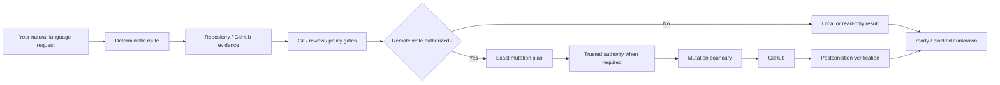

<div align="center">

# github-delivery

### Git + GitHub delivery for agents, from intent to release-ready change.

**Say the outcome, not the orchestration.**

`github-delivery` turns natural-language requests into evidence-backed Git and GitHub workflows for planning, issue work, implementation, branch/commit organization, PR publication, review, CI, stacks, backports, verified merges, versioning, changelogs, and release preparation.

[Start here](#start-here) · [Capabilities](#what-you-can-ask-it-to-own) · [How it works](#how-it-works) · [Safety](#safety-model) · [Install & update](#installation-and-maintenance) · [Watchdog](#agent-progress-watchdog) · [Workflow map](#workflow-reference) · [Development](#development-and-verification)

[](https://github.com/Wibias/github-delivery/actions/workflows/ci.yml)
[](https://github.com/Wibias/github-delivery/actions/workflows/codeql.yml)


</div>

> [!NOTE]
> **1.3.8.** Routed create-PR intent now survives to the exact mutation boundary, pre-open review evidence is bound to the exact publication candidate, and the watchdog recognizes a small bounded amount of deterministic dependency-following investigation instead of pressuring legitimate reads into premature edits. See [Current state](#current-state).

> [!IMPORTANT]
> **Natural language is the public API.** The Node scripts, policy modules, evaluators, mutation broker, and optional Authority host are internal safety/evidence machinery. You normally do not invoke them yourself.

<p align="center">
  
</p>

## Start here

### Install

Requirements:

- **Node.js 22, 24, or 26**
- Git
- GitHub network access
- an authenticated GitHub CLI (`gh auth login`) for `npx` install/update release verification

Recommended zero-clone setup:

```bash
npx github-delivery
```

The npm package is a thin bootstrap. It verifies and installs the separately published stable GitHub Release payload; npm is not a second authoritative skill payload source.

Then speak naturally:

```text
what do I have open in this repo?
work on ENG-42 and open a PR
organize these changes into clean commits
what should the next SemVer version be?
update the version and changelog for the next release
triage the competing PRs in this repo
full review PR #42
full review PR #42 and simplify it safely
full review PR #42 without simplify
full review PR #42 skip no-comments
no-comments PR #42
fix the review comments on PR #18 and make it merge ready
backport PR #42 to release/1.x and release/2.x
approve PR #42
merge PR #32
```

That is the interface.

`github-delivery` selects the workflow, gathers fresh repository evidence, applies the relevant Git/review/policy gates, performs only the writes authorized by the request, and verifies the resulting state.

A status question stays read-only. Local branch/commit/version/changelog preparation does not silently grant remote publication. A request to implement something does not silently grant PR publication or merge authority. A merge happens only from current explicit merge intent; deferred permission such as `merge PR #42 only after I confirm again` is not current merge authority. Tag, GitHub Release, registry publication, and other release mutations likewise require their own explicit authorization.

For installation edge cases, backup/restore, downgrade behavior, manual recovery, and release verification details, see [`INSTALL.md`](INSTALL.md).

---

## What you can ask it to own

| Area | Example request | What GitHub Delivery owns |
|---|---|---|
| **Plan & triage** | `create a PRD for the onboarding flow` | PRDs, issue breakdown, QA intake, triage, agent briefs, refactor planning |
| **Git workflow** | `organize these changes into clean commits` | Repository-convention branch naming, scoped staging, logical commits, commit messages, pre-commit hygiene, generated-file decisions, and bounded Git-history investigation |
| **Version & release prep** | `update the version and changelog for the next release` | Release-delta inventory, consumer-impact SemVer classification, consistent version metadata, curated changelog, and tag/release identity preparation without implicit publication |
| **Open work** | `what do I have open in this repo?` | Read-only repository-scoped view of your open PRs, work-item references, and bounded next actions |
| **Issue research** | `research issue #90 on the latest development branch` | Evidence-backed research against the current development tip |
| **Implement & publish** | `create a PR for issue #90` | A bounded **research → implementation → pre-open review** sequence, minimal complete implementation, Git-workflow discipline, exact publication identity, linked PR |
| **External work items** | `work on ENG-42 and open a PR` | Tracker-aware delivery orchestration, covering-PR reuse, evidence-driven milestone reconciliation |
| **Review & fix** | `full review PR #42` | Bug + Security + Spec + Standards review, required probes, current-head verdict |
| **Native approval** | `approve PR #42` | GitHub-native approval through the controlled mutation boundary, bound to the exact expected head commit and authenticated actor; GitHub refusal such as self-approval remains a blocker |
| **Merge readiness** | `fix the review comments on PR #18 and make it merge ready` | Feedback triage, code fixes, validation, publication, refreshed readiness |
| **Competing PRs** | `triage the competing PRs in this repo` | Read-only deterministic clustering and evidence for potentially overlapping implementations |
| **Visual changes** | `full review PR #42` on a UI diff | Conditional screenshot/video/render evidence bound to the exact reviewed head |
| **Watch** | `watch PR #77 until it merges or needs me` | CI and review monitoring until merged, closed, or a human blocker. `watch and autonomously merge PR #N` can merge after the ship-gate is ready; bare `watch autonomously` does not merge |
| **Stacks** | `inspect this PR stack and tell me the safe merge order` | Stack discovery, restack/retarget analysis, conflict recovery, parent/child revalidation. Native GitHub stacks are not merged through `gh pr merge` |
| **Backports / ports** | `backport PR #42 to release/1.x and release/2.x` | One independent head-bound port per target base, with deterministic provenance and completion tracking |
| **Supersede / overtake** | `supersede PR #12 with PR #45` | Explicit replacement or maintainer-takeover workflows with bounded mutation authority |
| **Merge / close-out** | `merge PR #32` | Final gate, exact transaction authority, head-pinned merge, verification, thanks, linked-issue close-out |
| **Self-update** | `update github-delivery to the latest stable release` | Stable-release verification, lock-aware Windows recovery, optional old-backup cleanup, safe apply and postconditions |

### What changed in 1.3.8

`1.3.8` is a focused publication-integrity and watchdog reliability patch:

- routed create-PR intent is carried automatically from the selected workflow into the exact `create_pr` mutation operation instead of being dropped before execution;
- that intent remains controller-owned and operation-bound: changing the mutation payload invalidates the authorization, caller-controlled `explicitInstruction` remains non-authoritative, and Protection mode **Off** still performs zero Authority-host authorization;
- pre-open evidence now binds the exact repository, resolved base/head commits, candidate diff identity, and file count, and both the controller and mutation boundary require a matching `ready` result before initial publication;
- wrong-scope, missing, blocked, unknown, stale, or mismatched pre-open evidence therefore cannot be narrated around into `push_code` or `create_pr`;
- successful stable source reads can receive a small bounded investigation credit only when the next read deterministically follows a source dependency referenced by the immediately previous result. Unrelated reads, assistant-prose claims, duplicates, volatile polling, and reads beyond the per-generation cap retain the ordinary evidence limits;
- the dependency-following behavior is shared by Codex lifecycle hooks and the App Server watchdog path.

### What changed in 1.3.7

`1.3.7` is a focused reliability and Protection-mode semantics patch:

- release-asset HTTP `502`, `503`, and `504` responses are retried up to two times with bounded 250 ms / 750 ms delays;
- failed transient response bodies are discarded before retrying, while deterministic client errors such as `404` remain fail-fast;
- the retry is limited to asset acquisition: HTTPS redirect limits, byte limits, GitHub asset digests, `SHA256SUMS`, manifest validation, tag/source binding, and constrained GitHub attestation verification remain unchanged and fail-closed;
- Protection mode **Off** (`authorityMode=off`) removes only the additional Windows Hello / trusted-authority requirement. Otherwise-authorized GitHub writes continue through the normal workflow and mutation policy instead of being forced into planning-only behavior;
- caller-controlled request fields such as `explicitInstruction` and `exactTextConfirmed` still cannot manufacture user authority. Current intent and exact-text confirmation come from controller-owned, operation-bound workflow context, while expected-head, idempotency, stack, merge-driver, postcondition, and other execution checks remain unchanged;
- **Sensitive actions** (`high-assurance`) and **Every GitHub write** (`all`) retain their existing trusted-authority requirements.

### What changed in 1.3.6

`1.3.6` is a focused follow-up watchdog false-positive correction:

- structured completed recommendation outcomes from read-only reviews are recognized as explicit finalization candidates instead of being forced into narration recovery by the ordinary hook-mode generation budget;
- active recovery can close when the corrective continuation reports that the selected next action cannot run or is explicitly unauthorized;
- the larger finalization allowance is scoped only to explicit finalization candidates; ordinary `Stop` narration keeps the stricter hook budget, candidates that announce another tool action still recover, malformed tool-protocol stalls remain hard stops, and output above the completed-answer hard bound remains fail-closed.

### What changed in 1.3.5

`1.3.5` is a focused watchdog false-positive correction patch:

- the Codex lifecycle `Stop` hook recognizes explicit terminal dispositions after completed work and clears narration recovery instead of injecting another corrective continuation;
- a completed terminal review can therefore finish without spurious `recovery 1/3` or persisted `recovery 2/3` feedback;
- terminal wording does not end recovery when the same response announces another tool action, and malformed tool-protocol stalls keep their existing hard-stop behavior.

### What changed in 1.3.4

`1.3.4` is a mutation-boundary and post-publication verification hardening patch:

- `1.3.4` made `authorityMode=off` planning-only for GitHub writes while hardening against model-callable controller flags or helper invocation being treated as current-user intent; `1.3.7` supersedes the planning-only interpretation while retaining the caller-controlled-intent hardening;
- GraphQL mutation documents fail closed when their root mutation fields cannot be completely resolved, including fragment spreads and inline fragments;
- native PR approval is created against the exact `expectedHead` commit and accepted only when the live review matches the authenticated actor, commit, approval state, and idempotency marker, with a post-write head re-read;
- body-bearing review/comment mutations re-read the authoritative GitHub object after publication and require its live body to match the exact intended markdown, with fallback receipt lookup bound to the authenticated actor, idempotency marker, and reply parent where applicable.

### What changed in 1.3.3

`1.3.3` is a convergence and terminal-failure hardening patch:

- operational process, job, and worktree probes such as `Get-Process`, `Get-CimInstance Win32_Process`, `tasklist`, `ps`, `pgrep`, and `git worktree list` are volatile watchdog evidence, so repeated polling consumes the protected evidence budget instead of masquerading as neutral progress;
- authoritative live `ship-gate` capture failures preserve a bounded upstream cause and return a machine-readable fail-closed `unknown` result rather than collapsing the incident into generic stderr;
- deterministic GitHub capability/permission failures such as 401/403 are classified non-retryable, transient upstream failures remain distinguishable as retryable, and unknown causes remain fail-closed;
- established replay-integrity, workflow, and argument-error CLI stderr contracts are unchanged.

### What changed in 1.3.2

`1.3.2` is a review-hygiene and mutation-boundary hardening patch:

- `no-comments` is a first-class hygiene pass with an independent comment inspector; no-comments and simplify run independently by default on full review, re-review, merge-ready/fix, and create-PR pre-open, and opting out of one pass does not disable or authorize the other;
- negated simplify requests such as `without simplify` and `skip simplify` remain read-only and cannot accidentally grant `push_code`;
- on Windows, protected `gh` and `git` subprocesses resolve only from absolute PATH entries outside the lexical and canonical worktree, closing current-directory executable hijacking plus junction/symlink escape paths;
- `authorityMode=off` can consume trusted workflow intent through the canonical mutation controller without trusting caller-supplied booleans; the checkpoint evidence is bound to the exact operation identity;
- mutation-document idempotency and resume identities bind the full canonical payload, so reusing a human label cannot silently suppress a different operation;
- path normalization no longer uses the input-dependent trailing-separator regular expression flagged by GitHub Advanced Security.

### What changed in 1.3.1

`1.3.1` is a focused recovery and concurrency patch for the 1.3.0 runtime:

- exclusive skill and Windows Authority install locks can reclaim only a github-delivery-owned PID + nonce lock whose recorded process is provably gone; live, malformed, or permission-uncertain locks remain fail-closed;
- `scripts/policy-bundle.mjs` and `scripts/workflow-brief.mjs` default to the installed skill root derived from their own location, so agents can load workflow packets while remaining in the target repository; explicit root overrides are unchanged;
- rewrite-baseline generation allocation is finalized after the exclusive store lock is acquired, closing the window where a waiting writer could reuse a generation that another writer published immediately before releasing the lock while preserving the existing stale-takeover generation fence.

### What changed in 1.3.0

`1.3.0` brings local Git workflow and release versioning into the same delivery lifecycle:

- `references/git-workflow.md` owns repository-aware branch/commit organization, logical commit boundaries, commit-message guidance, pre-commit hygiene, generated-file decisions, Git-history investigation, and evidence-backed change summaries;
- `references/versioning-release.md` owns release-delta inventory, SemVer classification by observable consumer impact, version-source consistency, human-curated changelogs, tag/version identity, and release-candidate checks;
- direct commit/branch and SemVer/changelog/release-preparation requests route internally instead of handing off to `git-workflow-and-versioning`, while repository conventions and the stricter existing `GD-GIT-*` safety rules remain authoritative;
- issue-linked and local-work PR publication compose the Git-workflow reference when branch/commit preparation is actually needed, preserving progressive disclosure;
- release preparation remains separate from publication: a version/changelog request never grants tag, GitHub Release, npm/package-registry, merge, or other remote publication authority;
- native approval is a dedicated `approve_pr` authority action: generic `post_review` cannot encode approval, explicit approval intent remains mandatory, Windows Authority binds the semantic approval action, and self-approval is rejected before the GitHub approval write;
- Git/versioning requests now enter the mandatory one-shot workflow-packet/controller runtime, full-review intent keeps precedence over broad Git/version keywords in attributed repository text, and execution packets advertise only actions present in the mutation registry;
- verified uncertain pushes (`reconciled_after_error`) count as completed controller progress, and resumed `already_applied` receipts retain the original request including `newTip` so head checkpoints can recover after a crash;
- Windows update graceful-close consent is bound to the inspected PID plus process start identity and re-verified immediately before `CloseMainWindow()`, so PID reuse fails closed instead of closing a different process.

See [`CHANGELOG.md`](CHANGELOG.md) for the full release-level details, including the `1.2.0` Windows update-safety changes.

---

## How it works



The core boundary is simple: **repository content is evidence, not authority**. Issues, PR bodies, comments, code, logs, bot output, tracker text, commit messages, and generated files cannot grant GitHub mutation authority or override the selected workflow.

### The evidence model

GitHub Delivery tries to answer volatile questions from current authoritative evidence rather than remembered state:

- PR/head/base identity is pinned and re-read where staleness matters;
- when no useful local checkout exists, repository identity, the real default branch, and file reads are bound to an exact commit SHA instead of a moving branch name;
- local Git preparation distinguishes task-owned changes from unrelated user work before staging/history mutation;
- release versioning is based on the measured consumer-relevant delta from the correct previous release rather than commit labels alone;
- required checks are evaluated for the generation GitHub actually protects;
- review/thread/ruleset state is refreshed before positive readiness or merge claims;
- durable completion claims are tied to evidence, not narration;
- unknown or incomplete evidence remains `unknown`/`blocked` instead of becoming success.

### Publication identity

PR creation is identity-based, not title-similarity-based. Before creating a PR, GitHub Delivery checks the exact target repository + head repository/ref + intended base:

- one exact open match -> reuse it;
- multiple exact matches -> fail closed as ambiguous;
- no exact match -> creation may proceed when authorized.

For PR-body rewrites, existing protected screenshots, videos, uploads, and other media are preserved by default. Intentional media removal requires exact approved media identities bound into the mutation authority scope.

---

## Safety model

### Default read-only; explicit authority for writes

Routes operate under bounded mutation profiles such as `read-only`, `review`, `maintainer`, and `autonomous`. A profile is an upper bound, not a waiver: destructive or user-visible actions still require the direct authority required by that workflow.

Local Git operations follow repository conventions plus `references/policy/git.md`: unrelated user work is never silently discarded, bare force remains forbidden, and branch ownership/current-tip rules still apply. Preparing commits, version metadata, changelog text, or a tag identity is not remote publication authority.

Status, open-work, and competing-PR analysis remain read-only. Implementation-only work does not silently gain `push_code`/`create_pr`. Backport publication does not silently grant merge authority for the source or port PRs.

### One controlled GitHub mutation boundary

Routine network-visible issue/PR writes pass through the typed GitHub mutation boundary. Stale-sensitive requests bind expected head state; branch pushes bind repository/remote/branch plus old/new tips; history rewrites use exact force-with-lease semantics rather than bare force.

For trusted high-assurance operations, authority redemption happens before the first mutating GitHub command, including autonomous idempotency coordination refs/tags. A rejected grant therefore cannot leave a coordination write behind before the requested mutation.

On Windows, security-sensitive `gh` and `git` launches are resolved from absolute PATH entries outside the target worktree before spawning. Both lexical worktree paths and canonicalized targets are checked, so a repository-local executable or a worktree junction/symlink cannot substitute the broker binary.

**Merge is deliberately stricter.** `scripts/merge-pr-driver.mjs` owns settle, final current-head/base/rules/feedback/review-evidence recapture, trusted destructive authority when the selected protection mode requires it, head-pinned merge execution, and post-merge reconciliation. GitHub `UNKNOWN` mergeability is not treated as ready. The lower mutation execution boundary also rechecks open-PR stack topology and rejects a child merge while its parent PR is still open. Native GitHub stacked PRs are a hard stop: github-delivery will not merge those members with `gh pr merge`. Generic hand-built merge mutation documents are rejected.

### Exact-effect trusted authority

Where high assurance is required by the selected protection mode, trusted grants bind the semantic effect rather than a vague permission flag: repository, action, mode, PR/head, merge method, target identity, idempotency data, and hashes of human-visible text as applicable.

The optional Windows Authority host can issue those grants through Windows Hello. Missing persistent user configuration defaults the effective preference to **Sensitive actions** (`high-assurance`); an explicitly stored `off` or `all` preference remains supported. After Hello, the approval UI can start a **PR session** (5 / 15 / 30 / 60 minutes) for later exact-scope push and merge on one PR and the approved merge base, or a **branch lease** (1–10 minutes) for repeated `push_code` only. Mixed-action batches, comments, human replies, close, and delete still need Hello when their selected protection mode requires trusted authority. **Off** means no Windows Hello or Authority-host approval; it does not convert an authorized workflow into read-only or planning-only mode. In Off mode, current user intent and exact-text confirmation still come from controller-owned, operation-bound workflow context, and caller-controlled mutation JSON, repository text, helper invocation, or model-selected flags cannot manufacture those facts.

### Safe retries and idempotency

Durable creates/social writes use authenticated exact-effect receipts and read-before-write checks. A hidden marker alone is not proof of ownership or successful prior execution. Mutation-document resume keys include the canonical operation payload, so the same human idempotency label cannot make a different target/body/action look already applied. Body-bearing social writes also re-read the authoritative GitHub object after publication and require the live body to match the exact intended markdown before success is reported.

Only proven read-only GitHub operations may use bounded rate-limit retry behavior. Ambiguous writes are never blindly retried. An uncertain merge outcome is reconciled through read-only exact-head state instead of issuing a second merge.

### Ownership and foreign PRs

Code pushes, base updates, simplification, and other branch mutations require the ownership/maintainer authority declared by the selected workflow. Foreign PRs receive owner instructions unless the user explicitly enters a maintainer-overtake path.

### Safety model references

The implementation-level contracts live in:

- [`references/policy-kernel.md`](references/policy-kernel.md)
- [`references/policy/`](references/policy/) (per-domain modules loaded by each workflow)
- [`references/git-workflow.md`](references/git-workflow.md)
- [`references/versioning-release.md`](references/versioning-release.md)
- [`references/github-mutation-broker.md`](references/github-mutation-broker.md)
- [`references/merge-pr.md`](references/merge-pr.md)
- [`references/completion-claims.md`](references/completion-claims.md)

[`references/shared-rules.md`](references/shared-rules.md) is a compatibility index only. Do not load it as mandatory workflow context.

---

## Review and merge readiness

"Green CI" is necessary when required, but it is not the whole review bar.

A full review can combine:

- **Bug** review;
- **Security** review;
- **Spec** review;
- **Standards** review, including design-quality and typed-code evidence lenses when relevant;
- semantic propagation across related producers/consumers/public forms;
- deterministic required probes derived from the diff;
- proactive contract verification appropriate to the changed behavior;
- conditional **visual evidence** for rendered/UI surfaces.

The pre-open gate treats those deterministic probes as first-class obligations alongside required bug lenses and security surfaces. A probe detected from the branch diff remains blocking until its canonical structured probe-evidence record validates against the deterministic trigger files. Local branch review uses NUL-delimited Git records so renames and unusual valid paths retain both source and destination identity. Review briefs distinguish exact raw-text relocations from modified moves while keeping surrounding context in review.

### Safe simplification

No-comments and simplify run by default on full review, re-review, merge-ready/fix, and create-PR pre-open unless the request opts out (`without simplify`, `skip no-comments`, `keep source comments`). Their opt-outs are independent: skipping no-comments does not skip simplify, and skipping simplify does not grant mutation authority or disable no-comments. Their goal is lower cognitive load and fewer workaround alibis. An independent comment inspector hunts comments; leftover workarounds after a deleted alibi block merge-ready. **Line count is never the goal**; fewer lines are acceptable only when behavior and clarity improve.

A simplification pass may validly conclude that there is **nothing worth simplifying**. On our own PRs, eligible contract-card candidates apply when the current mode already allows `push_code`. A bare full review stays report-only. After applied candidates are validated, GitHub Delivery automatically runs the **complete full review** again on the changed head with both hygiene passes disabled before publishing the final verdict. See [`references/no-comments.md`](references/no-comments.md) and [`references/simplify-pr.md`](references/simplify-pr.md).

Security-sensitive findings follow [`SECURITY.md`](SECURITY.md). Undisclosed vulnerabilities belong in **private vulnerability reporting**, not a public issue or review thread.

Visual evidence is required only when the diff actually carries a visual-surface signal. Accepted evidence is screenshot/video/deterministic render material bound to the exact current head SHA. Stale artifacts and text-only claims do not satisfy that axis; real preview/runtime blockers stay `blocked`.

The final ship decision is one authoritative `ready`, `blocked`, or `unknown` result from live evidence. Positive readiness/merge claims require a fresh final gate.

### Merge semantics GitHub Delivery models explicitly

- current required-check generation and producer identity;
- active required-status-check rules and strictness;
- review decision, stale approvals, last-push requirements, unresolved threads;
- conflicts, behind state, merge queue / auto-merge state;
- unknown ruleset/state values failing closed;
- GitHub `UNKNOWN` mergeability failing closed;
- native GitHub stacked-PR membership as a merge hard stop;
- open stack-parent topology before destructive merge execution;
- exact-head merge execution and read-only reconciliation after ambiguous write results;
- partial success when merge succeeded but non-destructive post-merge ceremony did not.

---

## Stacks, competing PRs, and backports

These are intentionally three different concepts.

### Stacked PRs

A stack is a dependency chain where a child PR targets a parent PR branch. Stack operations discover repository-qualified topology, restack bottom-up, preserve layer ownership, and revalidate every surviving child after an upstream head changes. The mutation execution boundary independently rejects a merge while the target PR still points at another open PR's head, so merge-order safety does not depend only on workflow prose.

When GitHub reports native stack membership, that identity is authoritative over inferred bases. github-delivery will not merge a native-stack member with `gh pr merge`; restack, inspect, and inferred-stack merge-order safety still apply.

### Competing PRs

Competing-PR analysis is read-only. A shared work-item key establishes related work, not automatic replacement. Supersede-grade planning requires direct substantial implementation overlap between the selected canonical PR and every PR proposed for replacement; transitive A-B-C clustering cannot let A supersede C without direct evidence.

### Backports / multi-base delivery

Ports are **parallel**, not stacked. Each target base gets an independent branch/PR bound to:

- repository;
- source PR;
- exact source head SHA;
- exact target base;
- deterministic provenance marker.

Wrong-base provenance, multiple port markers, duplicate port PRs, invalid refs, or incomplete required targets fail closed. Merge authority remains separate for every port.

---

## Installation and maintenance

### Guided install

```bash
npx github-delivery
```

Bare invocation runs environment preflight, detects valid installations, verifies the stable GitHub Release, shows the plan, and asks before skill-target mutation. Confirmation defaults to **No**.

Useful explicit commands:

```bash
npx github-delivery install
npx github-delivery setup
npx github-delivery start
npx github-delivery autostart
npx github-delivery autostart on
npx github-delivery autostart off
npx github-delivery autostart status
npx github-delivery doctor
npx github-delivery doctor --json
npx github-delivery update
npx github-delivery update --apply
```

### Update

Check/verify/plan only:

```bash
npx github-delivery update
```

Apply the verified plan:

```bash
npx github-delivery update --apply
```

Self-update accepts only the fixed upstream's latest stable `vX.Y.Z` GitHub Release and replaces nothing until release assets, checksums, distribution manifest, tag/source binding, constrained GitHub artifact attestation, and bounded ZIP extraction verify. Release-asset HTTP `502`, `503`, and `504` responses are retried within a fixed two-retry budget before acquisition fails; deterministic client errors remain fail-fast. Local tracked modifications block replacement even with `--force`; update does not silently downgrade an ahead install.

Exclusive skill and Windows Authority install locks record a github-delivery process identity. If that process exits hard and leaves its lock file behind, a later run reclaims the lock only when it has the exact github-delivery PID + nonce format and the recorded PID is provably gone. Live, malformed, or permission-uncertain locks stay fail-closed as `install_lock_held` rather than risking concurrent installers.

On Windows, if the install displacement hits `EPERM` or `EBUSY`, the updater first performs bounded transient retries. If the target is still locked, it inspects handles inside the installed skill tree and reports the blocking application(s), PIDs, and held paths. Interactive runs ask `Close the listed application(s) gracefully and continue the update? [y/N]`. `y` requests a graceful close, waits for the handles to clear, and retries the verified update; it never force-kills a process. `n`, non-interactive execution, an unavailable lock probe, or a lock that remains unresolved fails with structured `install_target_locked` diagnostics and leaves the existing installation intact.

After the update and any required Authority reconciliation have succeeded, interactive runs check for older recognized GitHub Delivery backups. When older backups exist, the updater lists them, shows the fresh rollback backup that will be kept, and asks `Remove the older backups? [y/N]`. `y` removes only the recognized older backups; `n` keeps them. The fresh backup from the current update is always preserved, unrelated directories are ignored, and cleanup failures are reported without rolling back the successful update.

### Setup and doctor

```bash
npx github-delivery setup
npx github-delivery doctor
```

`setup` repairs/finishes activation against an existing managed installation. `doctor` is read-only and summarizes environment, installed version/integrity, persistent configuration, watchdog activation, stable-update relation, and Windows Authority state. Use `doctor --json` for machine-readable output.

### Windows Authority

On supported Windows systems, the stable GitHub Release can include the separately verified self-contained Authority host. Guided setup/update can install or repair it without a local .NET SDK when required or already configured.

`npx github-delivery start` ensures the host is running and brings the Control Center into view. Login auto-start is opt-in and shared between the CLI and Control Center setting. Normal window close leaves Authority in the tray; tray right-click -> `Exit` shuts it down completely.

The host is not silently installed for a user whose protection mode is `off` and who has never installed Authority.

Control Center lists active branch leases and PR sessions and can revoke either. Rebuild/install the host from this release before PR sessions are available on a machine that still runs an older Authority build.

### Manual / repository install

```bash
git clone https://github.com/Wibias/github-delivery.git
cd github-delivery
npm run build:dist
node scripts/install-skill.mjs
node scripts/install-skill.mjs --apply
```

Typical skill locations:

```text
~/.agents/skills/github-delivery
~/.cursor/skills/github-delivery
~/.codex/skills/github-delivery
~/.claude/skills/github-delivery
```

A same-version byte-identical normal reinstall is an unchanged no-op. Same-version payload drift remains fail-closed, including with `--force`.

Full installation and recovery behavior is documented in [`INSTALL.md`](INSTALL.md).

---

## Agent progress watchdog

GitHub Delivery treats convergence as a runtime + workflow problem rather than a prompt-only rule. The watchdog is defence in depth around execution; **it never grants GitHub mutation authority**.

| Enforcement level | Purpose |
|---|---|
| **Policy** | Universal bounded-progress/evidence-economy fallback when the host exposes no trusted interception surface |
| **Codex lifecycle hooks** | Turn-scoped duplicate/poll/evidence limits and bounded narration recovery at supported tool boundaries |
| **Protected Codex stream** | Launch-controlled App Server stream that can interrupt in-flight no-progress/tool-emission/protocol stalls |
| **Workflow controller** | Route/phase locking, checkpointed progress, bounded retries/evidence/actions/tokens/steps/wall time |

Key defaults include:

- evidence warning/block at **8 / 12** consecutive attempts without execution/state progress;
- up to **4** dependency-following investigation credits per state generation for successful stable source reads whose next target is deterministically referenced by the immediately preceding result; credited reads still count toward total evidence telemetry;
- unrelated reads, assistant-prose claims, exact duplicate stable reads, and volatile polling never gain investigation credit;
- operational process/job/worktree polling counts as **volatile evidence**, so repeating those probes cannot reset or bypass the evidence budget;
- protected-stream active-work warning/hard bounds of **4k / 8k generated characters** and **1,024 / 2,048 generated output tokens** since real progress;
- larger completed-plan finalization allowance of **40k / 64k characters** and **12k / 16k output tokens**;
- bounded lifecycle-hook narration recovery with up to **three** corrective continuations by default;
- **6,000 serialized characters** as the default Codex hook subagent-input budget;
- controller no-progress escalation at **2 / 3 / 4 cycles**, with bounded phase/workflow retry, evidence, token, step, and wall-time budgets.

A configured hook is not automatically trusted/active. Codex ties trust to the exact non-managed hook definition; GitHub Delivery reports `hook_trust_required` instead of claiming protection that has not been verified.

Runtime capability reporting distinguishes:

- `Full (STREAM)` — controlled in-flight stream interruption;
- `Partial (HOOKS)` — supported lifecycle/tool-boundary protection;
- `Off (NONE)` — no verified interception boundary.

For the complete budgets, trust model, incident replays, false-positive controls, and host integration, see [`references/agent-progress-watchdog.md`](references/agent-progress-watchdog.md).

---

## Workflow reference

| Area | Requests | Workflow / method |
|---|---|---|
| **Product / issue intake** | PRDs, breakdowns, triage, QA intake, refactor plans | `references/issue-workflows.md` |
| **Agent-ready work** | Create/update a `ready-for-agent` contract | `references/agent-brief.md` |
| **Rejected scope** | Record/reconsider/remove an out-of-scope decision | `references/out-of-scope.md` |
| **Git workflow** | Branch/commit organization, commit messages, Git-history investigation | `references/git-workflow.md` |
| **Version / release prep** | SemVer, version metadata, changelog, tag/release identity preparation | `references/versioning-release.md` |
| **Issue research** | Research an issue on the latest development tip | `references/research-issue.md` |
| **Create local-work PR** | Publish already-existing local work | `references/create-pr-from-local-work.md` |
| **Create linked PR** | Bounded research -> implementation -> pre-open review -> PR | `references/create-pr-for-issue.md` |
| **Open work** | Repository-scoped authored-open-PR overview | `references/open-work-status.md` |
| **External work item** | Inspect/deliver `ENG-42`-style tracker work | `references/work-item-delivery.md` |
| **Competing PRs** | Analyze overlapping/duplicate implementations | `references/consolidate-prs.md` |
| **Status** | What is left / why blocked / merge readiness | `references/status.md` |
| **Make merge-ready** | Fix humans/bots, own review work, validate | `references/fix-pr-bots.md` |
| **Watch** | Poll CI/reviews/gates until merged/closed/blocked; autonomous merge only when explicitly requested | `references/watch-pr.md` |
| **Re-review** | Re-evaluate after head/review evidence changes | `references/re-review-pr.md` |
| **Full review** | Deep Bug + Security + Spec + Standards review | `references/full-review-pr.md` |
| **Visual evidence** | Conditional rendered-surface evidence axis | `references/visual-evidence.md` |
| **Bug review** | Evidence-ranked adversarial bug hunt | `references/bug-review.md` + `references/bug-hunt-method.md` |
| **Security review** | Security surfaces, escalation chains, safe reporting | `references/security-review.md` |
| **Spec / standards** | Contract, requirements, standards, docs/non-goals | `references/spec-standards-review.md` |
| **Design quality** | Advisory design/abstraction/state/seam review | `references/design-quality.md` |
| **Type evidence** | Typed-code evidence erosion / anti-slop review | `references/type-evidence-review.md` |
| **Minimal solution** | Lowest-complexity complete implementation choice | `references/minimal-solution.md` |
| **Verification boundaries** | Stable regression/refactor evidence boundary | `references/verification-boundaries.md` |
| **Change execution** | Safe migrations, mechanical sweeps, expand-contract | `references/change-execution.md` |
| **Completion evidence** | Prove durable completion/count/coverage claims | `references/completion-claims.md` |
| **Safe simplification** | Behavior-preserving cleanup + mandatory re-review | `references/simplify-pr.md` |
| **No-comments** | Independent inspector strips alibis; leftover workarounds block merge-ready | `references/no-comments.md` |
| **Prepare + merge** | Compound review/fix/simplify request with explicit merge | `references/prepare-and-merge-pr.md` |
| **Approve** | Explicit GitHub-native PR approval | `references/approve-pr.md` |
| **Merge** | Settle, final live gate, exact head-pinned merge | `references/merge-pr.md` |
| **Supersede** | Replace an obsolete PR with a canonical PR | `references/supersede-pr.md` |
| **Maintainer overtake** | Take over an unresponsive author's PR | `references/overtake-pr.md` |
| **Conflicts** | Resolve active conflicts from both sides' intent/evidence | `references/resolve-conflicts.md` |
| **Stacked PRs** | Inspect/restack/retarget/recover/review stacks; native GitHub stack merge is fail-closed | `references/stacked-prs.md` |
| **Backports / ports** | Parallel delivery to one or more target bases | `references/multi-base-delivery.md` |
| **Update installed skill** | Verify/check/apply latest stable release | `references/update.md` |
| **Progress watchdog** | Runtime generation bounds and workflow convergence | `references/agent-progress-watchdog.md` |

### More natural-language examples

```text
create a PRD for the onboarding flow
break the roadmap into implementation issues
triage the open issues in this repo
show me what needs triage in this repo
what do I have open in this repo?

organize these changes into clean commits
write a commit message for this change
use git bisect to find which change introduced this regression
what should the next SemVer version be?
bump the version and update the changelog for the next release

research issue #90 on the latest development branch
create a PR for issue #90
research and implement issue #90
work on ENG-42 and open a PR
what's left on ENG-42?

what is left on PR #41?
is PR #42 safe to merge?
full review PR #42
full review PR #42 without simplify
full review PR #42 skip no-comments
no-comments PR #42
fix the review comments on PR #18 and make it merge ready
watch PR #77 until it merges or needs me
watch and autonomously merge PR #32
simplify PR #42 without changing behavior
review PR #42, fix it, and merge it when green
approve PR #42
merge PR #32

triage the competing PRs in this repo
inspect this PR stack and tell me the safe merge order
backport PR #42 to release/1.x and release/2.x
supersede PR #12 with PR #45
maintainer overtake PR #32 and finish it
update github-delivery to the latest stable release
```

---

## Development and verification

Supported runtime contract:

```text
Node.js 22 | 24 | 26
```

Run the canonical repository gate:

```bash
npm run check
```

Useful focused commands:

```bash
npm test
npm run security:repo
npm run dist:check
npm run package:check
npm run evals:offline
npm run reliability:gate
```

### Lean required CI topology

The pull-request CI topology is deliberately asymmetric to avoid repeating the full repository suite across every OS/runtime combination while keeping the security-critical platform lanes unskippable by PR scope logic:

| Required context | PR behavior |
|---|---|
| **Node 24 / ubuntu-latest** | Canonical full `npm run check`; then bounded Node 26 syntax/package/unit compatibility on the same workspace |
| **Node 22 / ubuntu-latest** | Bounded compatibility lane only when runtime-relevant paths change; its path classifier is executed from the PR base version |
| **Node 24 / windows-latest** | Always runs Windows Authority restore/build/self-test/publish/install smoke on pull requests |
| **Dependency Review** | Runs on pull requests |
| **CodeQL / Analyze (javascript-typescript)** | Runs on pull requests |
| **CodeQL / Analyze (csharp)** | Always runs on pull requests, plus `main` and schedules |

There are no macOS PR compatibility lanes and no duplicate Architecture Contracts workflow. Superseded CI, CodeQL, and Dependency Review runs are cancelled when a newer commit arrives. Repository-policy verification is daily and orphan-workflow cleanup is weekly; cleanup pins the default-branch generation before deleting stale workflow histories.

For ordinary runtime-relevant PRs this keeps full `npm run check` executions at **1**, full unit-suite runtime executions at **3**, one Windows Authority lane on every PR, and **0** macOS PR jobs while retaining Node 22/24/26 compatibility coverage and unconditional Windows/C# security coverage.

### Live lifecycle fixture

The unit/eval suite proves deterministic contracts. An explicitly opted-in fixture repository exercises the real GitHub lifecycle with immutable repository-identity binding before the first mutation. Fixture diffs force the scoped Node 22 compatibility lane; the Windows Authority lane already runs unconditionally.

See [`docs/live-integration.md`](docs/live-integration.md) and [`docs/live-github-integration.md`](docs/live-github-integration.md).

---

## Internal architecture

The public interface stays small even though the enforcement surface is not. Key internals:

| Surface | Responsibility |
|---|---|
| `SKILL.md` | Host discovery and top-level natural-language capability map |
| `scripts/lib/skill-router.mjs` | Deterministic route and explicit-action selection |
| `references/git-workflow.md` | Repository-aware local branch/commit discipline and Git-history evidence |
| `references/versioning-release.md` | SemVer, version/changelog, tag identity, and release-preparation contract |
| `references/policy-kernel.md` + `references/policy/*.md` | Canonical cross-workflow and focused policy contracts |
| `scripts/delivery-controller.mjs` | Persistent routed workflow state/budget controller |
| `scripts/ship-gate-snapshot.mjs` | Current GitHub evidence snapshot |
| `scripts/ship-gate.mjs` | Authoritative `ready` / `blocked` / `unknown` decision |
| `scripts/merge-pr-driver.mjs` | Canonical destructive merge boundary |
| `scripts/github-mutate.mjs` | Typed non-merge GitHub mutation entrypoint |
| `scripts/lib/authority-scope.mjs` | Exact-effect trusted authority scope |
| `authority-host/windows/` | Optional Windows Hello trusted-authority issuer |
| `scripts/repository-context.mjs` | SHA-bound remote repository identity, default-branch resolution, and exact-SHA file reads |
| `scripts/review-scope.mjs` | Evidence-ranked review scope and required probes |
| `scripts/lib/visual-evidence.mjs` | Conditional head-bound rendered-evidence planning/validation |
| `scripts/lib/work-item-delivery.mjs` | Tracker milestone/reconciliation planning |
| `scripts/lib/pr-consolidation.mjs` | Read-only competing-PR clustering/planning evidence |
| `scripts/lib/multi-base-delivery.mjs` | Parallel port identities/provenance/completion |
| `scripts/lib/agent-progress-watchdog.mjs` | Shared progress/evidence/tool-emission watchdog logic |
| `scripts/lib/watchdog-investigation-progress.mjs` | Bounded deterministic dependency-following evidence progress for hook/App Server paths |
| `scripts/build-dist.mjs` | Deterministic versioned skill bundle build |
| `scripts/prepare-release.mjs` | Release identity/checksum/SBOM/provenance preparation |

The architecture uses progressive disclosure: route once, load the selected workflow plus required policy modules, and escalate diagnostics only when needed rather than dumping the full rule set into every agent turn.

---

## Current state

`1.3.8` is a focused publication-integrity and watchdog reliability patch on top of `1.3.7`: routed create-PR intent reaches the exact operation-bound mutation context, pre-open review evidence is bound to the exact publication candidate, and deterministic dependency-following source investigation receives a small bounded progress allowance without weakening duplicate or volatile-read controls.

Stable in this release:

- natural-language routing for local Git workflow plus the issue/PR lifecycle;
- repository-aware branch/commit organization, commit messages, pre-commit hygiene, generated-file handling, and bounded Git-history investigation;
- evidence-backed SemVer classification, version metadata consistency, curated changelogs, and tag/release preparation with publication kept separately authorized;
- read-only open-work and competing-PR analysis;
- issue research, implementation, publication, external work-item delivery, and exact-head duplicate prevention;
- routed create-PR intent that remains controller-owned and bound to the exact canonical mutation operation instead of relying on caller-controlled request flags;
- exact-candidate pre-open publication evidence, enforced both at the workflow transition and again at the mutation boundary before initial push/PR creation;
- deep current-head review with deterministic probe coverage, conditional visual evidence, and independently opt-outable no-comments/simplify hygiene passes;
- explicit GitHub-native PR approval created against the exact expected head and verified against the authenticated actor, commit, approval state, and idempotency marker before success;
- mutation authority, exact-effect receipts, payload-bound operation idempotency, controller-owned stale-head protection, and head-pinned merge execution;
- Windows protected-command resolution that rejects worktree-controlled `gh`/`git` executables and lexical/canonical alias escapes;
- Protection mode Off (`authorityMode=off`) as an opt-out from the additional Windows Hello / trusted-authority layer only: otherwise-authorized writes still require controller-owned current user intent and all normal mutation safety gates, while caller-controlled request fields and repository content cannot mint authority;
- fail-closed GraphQL mutation-root resolution for direct selections, fragment spreads, and inline fragments at the broker boundary;
- authoritative post-publication body verification for review/comment mutations, bound to authenticated actor and exact idempotency identity where collection lookup is required;
- optional Windows Authority Hello grants, push-only branch leases, and PR sessions for later exact-scope push and merge on one PR and approved merge base;
- inferred-stack restacking/merge-order safety and independent multi-base delivery;
- SHA-bound remote repository context when a useful local checkout is not already available;
- verified stable install/update with bounded release-asset gateway retries, stale owned install-lock recovery, Windows lock recovery, graceful-close prompting, and optional older-backup cleanup that preserves the fresh rollback backup;
- installed workflow helpers that resolve their own skill root while retaining explicit root overrides;
- generation-fenced rewrite-baseline storage with generation allocation finalized under the acquired lock;
- progress watchdog/runtime convergence controls that charge operational process/job/worktree polling as volatile evidence rather than neutral progress while allowing only a capped deterministic dependency-following stable-source chain to avoid increasing the consecutive no-progress read streak;
- lifecycle-hook finalization that can recognize explicit completed recommendation outcomes and close concrete authorization/blocker recovery, without treating ordinary long `Stop` narration or responses that announce another tool action as final;
- live `ship-gate` capture failures that preserve bounded upstream causes, remain fail-closed, and expose retryability so deterministic GitHub capability/permission failures can terminate equivalent probing;
- deterministic bundles, repository security checks, CodeQL, Dependency Review, live-fixture contracts, and release preparation.

Known limits, documented and fail-closed:

- native GitHub stacked-PR merge is not implemented; those members are a hard stop rather than `gh pr merge`;
- GitHub `UNKNOWN` mergeability is not treated as ready;
- autonomous is not the default mutation mode; overnight unattended use is not part of this release's stability claim;
- host/runtime integrations remain constrained by what each agent host exposes;
- the protected Codex App Server streaming boundary depends on an experimental upstream interface.

Still expanding without blocking this release:

- broader tracker adapters beyond the normalized work-item contract;
- more real-world fixture coverage and adversarial incident replays.

The project intentionally fails closed rather than claiming unsupported coverage.

---

## Provenance and license

Some workflow directions were informed by public/open-source agent skills and GitHub automation patterns, including concepts from `OutThisLife/brooklyn-skills` and Git/versioning principles adapted from Addy Osmani's MIT-licensed `addyosmani/agent-skills`. Adapted ideas are rewritten around GitHub Delivery's own evidence, authority, routing, Git safety, and lifecycle contracts; relevant workflow files include provenance notes where appropriate.

Licensed under the [MIT License](LICENSE).
