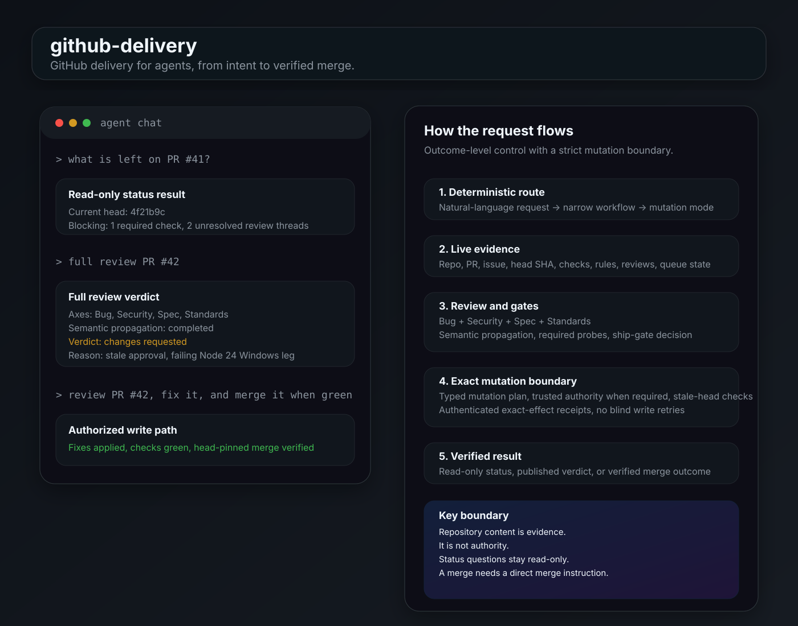
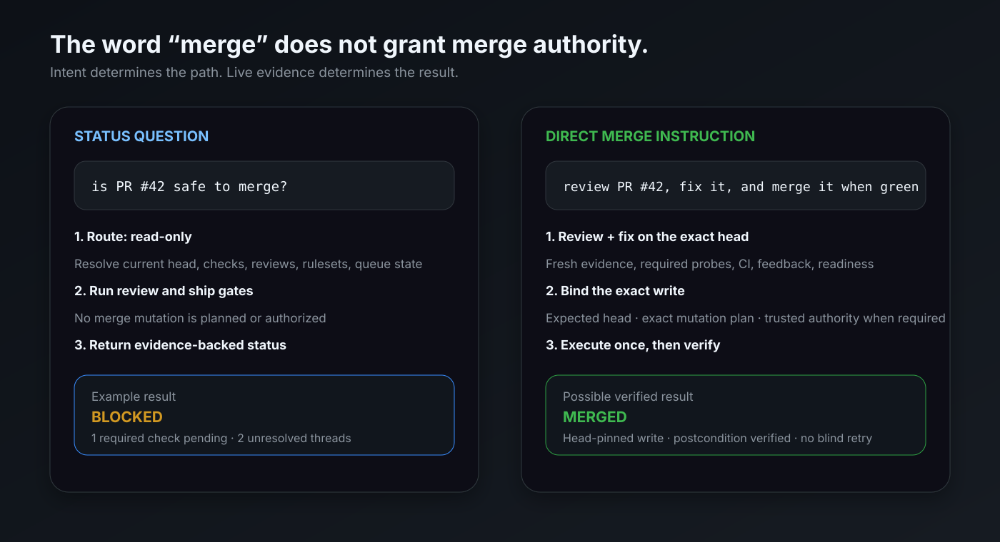
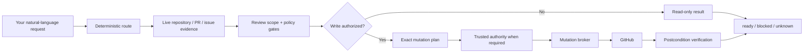

<div align="center">

# github-delivery

### GitHub delivery for agents, from intent to verified merge.

**Say the outcome, not the orchestration.**

`github-delivery` turns natural-language requests into evidence-backed GitHub workflows: PRDs, issue research, implementation, deep review, CI, fixes, stacks, verified merges, and verified stable self-update. Its v0.5 progress stack combines a persistent workflow controller, semantic evidence reuse, and hard cross-channel Codex generation bounds to stop narration/read/tool-emission loops without weakening GitHub authority gates.

[Quick start](#try-it-in-60-seconds) · [Self-update](#update-an-installed-release) · [Progress watchdog](#agent-progress-watchdog) · [What it can own](#what-you-can-ask-it-to-own) · [Safety model](#safety-model) · [Installation](#installation)

[](https://github.com/Wibias/github-delivery/actions/workflows/ci.yml)
[](https://github.com/Wibias/github-delivery/actions/workflows/codeql.yml)


</div>

> [!WARNING]
> **Active development.** The complete issue/PR lifecycle and core safety architecture are implemented, but the project is not yet 100% production-ready. I currently consider it roughly **80% of the way there**. See [Current state](#current-state).

> [!IMPORTANT]
> **Natural language is the public API.** The Node scripts, policy modules, authority layer, evaluators, and mutation broker are internal safety and evidence machinery. You normally do not invoke them yourself.

<p align="center">
  
</p>

## Try it with one sentence

```text
what is left on PR #41?
full review PR #42
fix the review comments on PR #18 and make it merge ready
review PR #42, fix it, and merge it when green
update github-delivery to the latest stable release
```

That is the interface.

`github-delivery` determines the workflow, gathers fresh GitHub evidence, performs the required review and policy gates, makes only the writes authorized by the request, and verifies the resulting state.

A status question stays read-only. A merge happens only from an actual merge instruction. Deferred permission such as `merge PR #42 only after I confirm again` is **not** current merge authority.

## Try it in 60 seconds

### Requirements

- **Node.js 22, 24, or 26**
- Git
- GitHub network access
- an authenticated GitHub CLI (`gh auth login`) for release verification during `npx` install/update

A host-provided brokered GitHub connector can still satisfy normal GitHub workflow access after installation, but the `npx` bootstrap itself verifies the published release with the GitHub CLI and does not change your authentication.

### Guided install

The recommended zero-clone path is:

```bash
npx github-delivery
```

Bare invocation launches the guided setup. It runs a real environment preflight before release acquisition or mutation, detects valid existing installations, verifies the latest published stable GitHub Release, shows the install plan, and asks before any skill-target mutation. Confirmation defaults to **No**.

The npm package is only the bootstrap. The installed skill payload still comes from the fixed upstream's separately verified stable GitHub Release; npm is not a second authoritative skill payload source.

On supported Windows systems, stable GitHub Releases also carry a **separately verified, self-contained Authority host component** built from the same tagged commit. Managed setup/update can install or repair that component without a local .NET SDK. It is not silently installed for a user whose protection mode is `off` and who has never installed Authority.

On a fresh machine, the guided flow installs the verified release and then walks through any remaining host setup. With an existing valid installation, it offers **Update / Repair setup / Exit** rather than silently reinstalling or updating. If loop interruption is still inactive after a guided install, the CLI prints a prominent postflight warning with the concrete remediation: review/trust the GitHub Delivery definitions in `/hooks`, then rerun `npx github-delivery setup`.

Explicit commands are also available:

```bash
npx github-delivery install
npx github-delivery setup
npx github-delivery doctor
npx github-delivery doctor --json
npx github-delivery update
npx github-delivery update --apply
```

Then use the skill naturally:

```text
full review PR #42
```

For full install, upgrade, restore, downgrade, force, self-update, and manual-install behavior, see [`INSTALL.md`](INSTALL.md).

### Update an installed release

Check first:

```bash
npx github-delivery update
```

Apply only after reviewing the verified plan:

```bash
npx github-delivery update --apply
```

The first command is a dry-run. Self-update accepts only the fixed upstream's latest published stable `vX.Y.Z` GitHub Release and replaces nothing until the release assets, checksums, manifest, exact tag/source commit, constrained GitHub artifact attestation, and strict ZIP extraction all verify. Local tracked modifications block skill replacement even with `--force`; skill downgrades are never performed through `update`.

On Windows, the same update reports the Authority host separately. An already-installed or required stale/legacy Authority host is acquired from its own versioned, attested release asset and kept aligned with the stable skill version. That repair can happen even when the skill itself is already current. If Authority was never installed and protection is `off`, it remains absent; if the installed Authority host is ahead of stable, it is not automatically downgraded.

The compatibility `scripts/update-skill.mjs` command and the installed `node scripts/install-skill.mjs --update` path still forward to the same verified updater. See [`references/update.md`](references/update.md) and [`INSTALL.md`](INSTALL.md).

### Finish setup or diagnose an installation

After installing, repairing host integration, or reviewing changed Codex hooks, run:

```bash
npx github-delivery setup
```

`setup` works only against an existing valid installation. It never substitutes the ephemeral npm package for the installed skill source and never bypasses Codex hook trust. On supported Windows, it also reconciles a required or already-configured Authority host through the verified stable component path.

For a read-only health report:

```bash
npx github-delivery doctor
```

`doctor` is human-readable and actionable by default. It summarizes environment prerequisites, detected installation/version, manifest integrity and local tracked modifications, persistent configuration readability, Codex activation/watchdog state, latest stable version, update relation, and the Windows Authority component without repairing or changing credentials. If loop interruption is inactive, it surfaces a prominent **`LOOP INTERRUPTION NOT ACTIVE`** state with `/hooks` and `github-delivery setup` remediation. Use `npx github-delivery doctor --json` when you need the raw machine-readable report. Authority details include support/install state, version/source commit, whether the effective protection mode requires it, and relations such as `missing`, `legacy`, `update`, `already_current`, or `already_ahead`.

### Manual / repository install

For repository development, non-standard targets, or manual recovery, the existing installer remains supported:

```bash
git clone https://github.com/Wibias/github-delivery.git
cd github-delivery
npm run build:dist
node scripts/install-skill.mjs
node scripts/install-skill.mjs --apply
```

Re-running the normal installer with the **same version and byte-identical payload is intentionally idempotent**: it succeeds as an unchanged no-op with no backup or replacement. A same-version payload that differs from the installed files still fails closed, including with `--force`.

Typical skill locations include:

```text
~/.agents/skills/github-delivery
~/.cursor/skills/github-delivery
~/.codex/skills/github-delivery
~/.claude/skills/github-delivery
```

### Codex progress watchdog

On a detected Codex install, the normal apply path configures GitHub Delivery's lifecycle-hook entries automatically. Codex requires new or changed non-managed hooks to be reviewed and trusted before they run, so open `/hooks`, review the exact GitHub Delivery definitions, and trust them. Then finish/refresh activation through the installed skill with:

```bash
npx github-delivery setup
```

Trusted lifecycle hooks use turn-scoped state, keep evidence reads/searches from resetting the no-progress detector, warn after **8 consecutive evidence attempts** without execution/state progress, and deny the **12th** supported evidence attempt until the turn makes real progress. Exact duplicate reads, rapid repeated polls, and supported semantically covered evidence are blocked independently. Successful `PostToolUse` results are never replaced or truncated by the generic watchdog.

Hooks still cannot interrupt assistant text before a local tool boundary. To stop in-flight narration/tool-emission loops and to bound hosted activity visible through App Server, launch Codex through the installed protected streaming boundary:

```bash
node ~/.agents/skills/github-delivery/scripts/codex-with-watchdog.mjs
```

The protected launcher keeps watchdog state per turn, observes agent-message/reasoning/plan generation through one shared detector, uses plan/diff/output-token events as real progress/budget signals, and can issue one private `turn/interrupt`. Active no-progress generation has hard character/output-token backstops in addition to repeat/tool-emission/protocol detection. The bridge fails closed if required stream notifications disappear or a requested interrupt cannot be confirmed. It declares `stream` only inside the process tree it actually controls. Plain `codex` and IDE sessions are not silently rerouted or falsely reported as streaming-protected. Codex currently documents `app-server` and its WebSocket transport as experimental and unsupported for production workloads, so this is the strongest current boundary for the failure mode rather than a stable production host API. See [Agent progress watchdog](#agent-progress-watchdog) and [`INSTALL.md`](INSTALL.md).

## Why this is different

| Problem | github-delivery's answer |
|---|---|
| **"Green CI" is not the same as "safe to merge."** | Bug + Security + Spec + Standards review, semantic propagation, required probes, review state, rulesets, merge-queue state, and exact-head evidence feed one authoritative ship decision. |
| **Agents can burn tokens without making progress.** | A persistent workflow controller bounds rerouting/replanning, semantic evidence keys stop equivalent re-reads, and the protected Codex stream hard-bounds cross-channel narration, unique no-progress generation, tool-emission stalls, malformed tool protocol output, and output-token growth. |
| **Agent intent can be ambiguous.** | Deterministic natural-language routing keeps status questions read-only and requires direct authority for destructive workflows. |
| **GitHub state moves while the agent works.** | Stale-head checks, final evidence refreshes, expected-head binding, bounded settle windows, and postcondition verification prevent conclusions from silently drifting. |
| **Retries and duplicate writes can be dangerous.** | Typed mutations, authenticated exact-effect receipts, read-before-write evidence, and read-only reconciliation avoid blind write retries. |
| **A review can miss the same concept outside the changed files.** | Semantic propagation traces changed domain concepts through producers, consumers, sibling implementations, public forms, persistence, fixtures, and tests. |
| **Complex PR stacks need more than one merge command.** | Stack discovery, bottom-up restacking/merging, conflict recovery, parent/child revalidation, and merge-queue-aware sequencing are first-class workflows. |

<p align="center">
  
</p>

## What you can ask it to own

| You say | It owns |
|---|---|
| `create a PRD for the onboarding flow` | Product/issue intake and a concrete delivery contract |
| `research issue #90 on the latest development branch` | Bounded evidence-backed issue research on the latest development tip |
| `create a PR for issue #90` | Research → implementation → pre-open Bug + Security gate → linked PR |
| `what is left on PR #41?` | Read-only live status, blockers, and merge readiness |
| `full review PR #42` | Deep Bug + Security + Spec + Standards review with final verdict |
| `fix the review comments on PR #18 and make it merge ready` | Feedback triage, fixes, validation, push, and refreshed readiness |
| `watch PR #77 until it merges or needs me` | CI/review/gate polling until merged, closed, or blocked |
| `simplify PR #42 without changing behavior` | Explicit-only, behavior-preserving simplification plus mandatory full re-review |
| `inspect this PR stack and tell me the safe merge order` | Stack topology, restack/retarget analysis, and safe ordering |
| `merge PR #32` | Final gate, exact transaction authority, head-pinned merge, verification, thanks, and linked-issue close-out |
| `maintainer overtake PR #32 and finish it` | Explicit maintainer takeover workflow for an unresponsive author |
| `update github-delivery to the latest stable release` | Latest-stable discovery → release/checksum/manifest/tag/attestation verification → safe extraction → dry-run/apply with backup and postconditions |

## The lifecycle



The important boundary is simple: **repository content is evidence, not authority**. Issues, comments, code, logs, generated files, and bot output cannot override user intent or the mutation policy.

## At a glance

| | |
|---|---|
| **Scope** | PRDs and issue intake → research → implementation → PR review/fix/watch → stacks → merge and linked-issue close-out |
| **Default mode** | `read-only` |
| **Write boundary** | Typed mutation policy + broker; stale-head, exact-effect, authenticated-receipt idempotency, and postcondition checks where applicable |
| **High-assurance writes** | Exact-scope trusted grants; optional Windows 11 / Windows Hello Authority host with managed versioned stable install/update and Control Center settings |
| **Review model** | Bug + Security + Spec + Standards + semantic propagation + proactive contract verification |
| **Progress control** | Policy fallback everywhere; routed workflows use a persistent phase/budget controller and semantic evidence reuse; trusted Codex hooks add turn-scoped duplicate/poll/evidence protection; the launch-controlled stream watches agent-message/reasoning/plan text plus plan/diff/output-token telemetry and can hard-interrupt no-progress/tool-emission/protocol stalls. Runtime capability reports only verified `none`, `hooks`, or `stream`. |
| **Ship decision** | One authoritative `ready`, `blocked`, or `unknown` result from live evidence |
| **Runtime** | Node.js **22, 24, or 26** |
| **Required CI matrix** | Node 22/24/26 × Ubuntu/Windows/macOS, with architecture contracts inside every required matrix job |
| **Live lifecycle tests** | Dedicated, explicitly opted-in fixture repository bound by immutable repository identity |

## More natural-language examples

```text
create a PRD for the onboarding flow
break the roadmap into implementation issues
triage the open issues in this repo
run QA intake on the payment bug report
research issue #90 on the latest development branch
create a PR for issue #90

what is left on PR #41?
is PR #42 safe to merge?
full review PR #42
fix the review comments on PR #18 and make it merge ready
watch PR #77 until it merges or needs me
simplify PR #42 without changing behavior
full review PR #42 and simplify it safely
review PR #42, fix it, and merge it when green
merge PR #32
merge PR #42 only after I confirm again

inspect this PR stack and tell me the safe merge order
supersede PR #12 with PR #45
maintainer overtake PR #32 and finish it
update github-delivery to the latest stable release
```

## Full workflow map

| Area | Requests | Workflow |
|---|---|---|
| **Product / issue intake** | PRDs, breakdowns, triage, QA intake, refactor plans | `references/issue-workflows.md` |
| **Agent-ready work** | Create/update a `ready-for-agent` contract | `references/agent-brief.md` |
| **Rejected scope** | Record, match, reconsider, or remove an out-of-scope decision | `references/out-of-scope.md` |
| **Issue research** | Research an issue on the latest development tip | `references/research-issue.md` |
| **Create a linked PR** | Bounded research → implementation → pre-open review → PR | `references/create-pr-for-issue.md` |
| **Make a PR merge-ready** | Fix humans/bots, own bug/security/spec work, validate | `references/fix-pr-bots.md` |
| **Watch a PR** | Poll CI/reviews/gates until merged, closed, or blocked | `references/watch-pr.md` |
| **Re-review** | Re-evaluate after new commits, humans, CodeRabbit/Codex, or other review evidence | `references/re-review-pr.md` |
| **Full review** | Deep Bug + Security + Spec + Standards review and final verdict | `references/full-review-pr.md` |
| **Bug review** | Evidence-ranked adversarial bug hunt | `references/bug-review.md` + `references/bug-hunt-method.md` |
| **Security review** | Security surfaces, escalation chains, exploit-safe reporting | `references/security-review.md` |
| **Spec / standards** | Contract, requirement, standards, docs and non-goal review | `references/spec-standards-review.md` |
| **Safe simplification** | Behavior-preserving cleanup with approval and mandatory re-review | `references/simplify-pr.md` |
| **Status** | What is left / why blocked / merge readiness | `references/status.md` |
| **Prepare + merge** | Compound review/fix/simplify request that explicitly includes merge | `references/prepare-and-merge-pr.md` |
| **Merge** | Final gate, exact transaction authorization, final-boundary recheck, head-pinned merge, thanks, linked-issue close-out | `references/merge-pr.md` |
| **Supersede** | Close an obsolete PR in favor of a replacement | `references/supersede-pr.md` |
| **Maintainer overtake** | Take over an unresponsive author's PR under explicit maintainer scope | `references/overtake-pr.md` |
| **Conflicts** | Resolve active conflicts from both sides' intent/evidence, then resume | `references/resolve-conflicts.md` |
| **Stacked PRs** | Inspect, restack, retarget, recover, review and merge stacks | `references/stacked-prs.md` |
| **Update installed skill** | Check/apply the latest verified stable GitHub Release without a repository checkout | `references/update.md` |
| **Agent progress watchdog** | Runtime generation bounds, semantic evidence economy, polling/tool-emission protection, and workflow convergence | `references/agent-progress-watchdog.md` |

For oversized-change splitting, post-ship branch/worktree cleanup, and version/tag/changelog work, `SKILL.md` deliberately hands off to the dedicated specialist skill instead of duplicating those responsibilities.

---

## Safety model

### 1. Default read-only; explicit intent for state changes

`github-delivery` routes requests into four upper-bound profiles:

- `read-only`
- `review`
- `maintainer`
- `autonomous`

The profile is not a waiver. Maintainer-grade actions such as merge, close, supersede, reviewer changes, ordinary human-thread resolution, or branch deletion still require the direct instruction required by the selected workflow.

The merge router uses a narrow positive command grammar. Status questions containing words such as *merge* or *ship* do not silently become destructive requests. Future or conditional permission is also excluded: confirmation/approval that the user explicitly defers until later remains read-only until the later confirmation actually happens.

### 2. Every network-visible GitHub write crosses one mutation boundary

Creating/editing issues or PRs, labels, assignments, comments, reviews, thread state, draft state, reviewers, remote branches, closes, merges, and follow-up objects are brokered through `scripts/github-mutate.mjs`, `scripts/lib/github-mutation-router.mjs`, and the lifecycle/legacy broker implementations behind that router.

The action model is centralized in `scripts/lib/mutation-action-registry.mjs`. Policy, broker behavior, routing/high-assurance semantics, and architecture tests are derived or cross-checked from that registry so adding an action cannot silently skip a safety layer.

PR mutations that can become stale are bound to the **expected head** and re-read it immediately before execution. Branch pushes bind the intended repository/remote/branch and exact old/new tips; history rewrites use exact `--force-with-lease`, never bare force.

A repository-wide mutation-boundary regression check rejects direct production GitHub/remote-Git write paths outside the approved boundary.

### 3. Trusted authority binds the exact effect

Caller fields such as `mutationMode`, `explicitInstruction`, `exactTextConfirmed`, `source: user`, or `trusted: true` are policy assertions — not proof of consent.

Where trusted authority is required, a host-issued grant binds a deterministic `scopeSha256` over the semantically relevant effect: repository, action, mode, PR/head, merge method, targets, idempotency key, and hashes of human-visible text. Redemption-required grants are short-lived and one-time.

Protected thread-state mutations are part of that high-assurance boundary. In particular, `resolve_bot_thread` cannot be authorized merely because repository/bot content caused the request; the Windows authority host classifies it as Windows Hello-protected even in `review` mode.

#### Human-thread replies

A human reply can be **planned** so its exact text is visible, but execution requires both:

- exact-text confirmation bound to the outgoing body; and
- trusted scoped authority.

A caller-computed hash or boolean cannot authorize the reply by itself.

#### Full-review verdict provenance

A format-valid `[GD]` verdict posted by the authenticated GitHub actor is not automatically trusted merge evidence.

Full-review publication is a high-assurance special case: `scripts/github-authorize.mjs` stamps durable hidden authority provenance onto the exact reviewed-head verdict request. `scripts/verify-verdict-published.mjs` verifies both the verdict format and the historical trusted-authority provenance at the comment's creation time. Same-actor lookalike verdicts without a valid scoped grant are rejected as merge-review evidence.

### 4. Exact idempotency receipts and safe retries

Durable creates and social writes use stable idempotency keys plus remote read-before-write evidence, but a predictable hidden marker is **not** sufficient proof that the intended effect already happened.

Receipt reuse is bound to the authenticated GitHub actor and the exact visible effect. The verifier rejects foreign-actor marker collisions, rejects pull requests returned by the Issues API when verifying issue creation, binds PR creation to the intended title/base/head, and binds review-thread replies to the intended parent comment. Autonomous same-key effects still use a remote claim so competing workers cannot both publish the same durable effect.

GitHub rate-limit retries are deliberately asymmetric:

- only commands proven **read-only** may retry;
- `Retry-After` and `X-RateLimit-Reset` are honored when present;
- fallback backoff is bounded, with **3 attempts by default**;
- GraphQL `mutation`, GitHub writes, and ambiguous API calls are **never blindly retried** after an unknown result.

A merge write that returns a non-zero/transport error after the exact write reached the runner is handled by **read-only reconciliation**, not a second merge attempt. The broker re-reads the exact-head merge state and returns `reconciled_after_error` only when GitHub proves the intended merged/queued/auto-merge outcome. If the result cannot be proved, the outcome remains explicitly unknown.

### 5. Ownership and foreign-PR boundary

Base updates, scoped code pushes, and simplification edits are performed only when the workflow has the required ownership/write authority. Foreign PRs receive exact owner instructions unless the user explicitly enters the maintainer-overtake workflow.

### 6. Progress and context economy cannot weaken the gates

The progress stack is defence in depth around agent execution. It does **not** grant GitHub mutation authority, execute writes on the agent's behalf, or turn omitted/unknown evidence into success.

- Stable read fingerprints bind state generation + tool + canonical input; exact duplicates are blocked only while that state remains unchanged.
- Supported authoritative evidence also gets semantic resource/coverage identities, so changing a shell filter does not manufacture new evidence for the same already-covered resource.
- Evidence reads/searches do not reset the turn's narration detector. Supported hook paths warn at 8 consecutive evidence attempts without execution/state progress and deny the 12th until real progress occurs.
- Volatile status reads are rate-limited rather than cached forever. A relevant state change invalidates state-bound read/evidence caches.
- Unknown or ambiguous tools remain neutral rather than being counted as execution/state progress merely because they completed.
- A real tool **start** clears only the "tool was never emitted" signal; it does not erase narration/no-progress history until execution/state/plan/diff progress is proved.
- Protected stream mode shares one detector across agent-message, reasoning-summary, supported raw-reasoning, and plan text, with hard generated-character and output-token backstops since the last real progress.
- Successful lifecycle-hook tool results are left intact. Output economy is source/helper-owned so watchdog feedback cannot destroy evidence and provoke a second read.
- Oversized subagent inputs are rejected by the Codex hook adapter with a **6,000-character default budget** so large parent context is referenced rather than recopied.
- Routed workflows use a persistent phase controller: rewording narration is not controller progress, and route/phase/evidence/retry/token/wall-time budgets bound orchestration drift independently of the per-turn stream watchdog.

---

## Review depth: more than "the checks are green"

A merge-ready or full-review path does not outsource judgment to CI or bots. The `blocking` scope rule is a binding readiness contract: a scope component marked blocking cannot be silently skipped, treated as advisory, or reported clean without its required evidence.

### Multidimensional review

The review bar combines:

- **Bug** review
- **Security** review
- **Spec** review
- **Standards** review
- repository-wide **semantic propagation** when a domain concept changes
- **Proactive contract verification** appropriate to the diff

Review depth is derived from changed paths, patch content, symbols, removed controls, dependencies, workflow permissions, architecture surfaces, and uncertainty — not filenames alone.

### Semantic propagation

Changed files are only the starting points. A full review traces each changed domain concept from its authoritative source through producers, consumers, sibling implementations, derived/public representations, persistence/serialization, fixtures, and tests.

Families such as provider sets, capability tables, schemas, enums, platform matrices, registries, or defaults are partitioned by materially different behavior. One representative is not accepted as coverage for the whole family unless equivalence is actually proved.

### Adversarial bug review

The bug axis uses a built-in **Finder → Challenger → Arbiter** method. Static-analysis leads and tool-free heuristics feed finding cards with explicit evidence and a Gate 0 impact bar. Coverage is reported honestly as `confirmed`, `dismissed`, `manual-review`, or `unreviewed`; partial coverage is never presented as clean.

### Deterministic probes and machine-checkable coverage

Known bug/security classes are named probes in `scripts/lib/probe-registry.mjs`.

- Diff shape deterministically produces `requiredProbes`.
- Offline scope fixtures pin the exact expected probe set.
- Retained regression assertions are bound to documentation anchors.
- Each required probe must emit `{ probeId, status, files?, reason? }` evidence.
- A required probe with concrete trigger files must resolve to `clean` or `findings`; it cannot be downgraded to `n-a` by free-form model prose.
- `n-a` remains valid only for the no-trigger edge case and requires a non-empty reason.
- `scripts/verify-probe-coverage.mjs` must accept that evidence before the axis can be considered complete.

Dropping a trigger, probe tag, assertion anchor, or required application record is a CI failure rather than silent review drift.

### Proactive contract verification

Depending on the diff, the review actively checks contracts such as wiring, operator smoke behavior, test honesty, docs/non-goals, input shape, evidence semantics, scale/determinism, malformed-input handling, serialization budgets, recursive termination, and CLI/API payload completeness.

Passing bots are necessary evidence when required, but are never sufficient proof by themselves.

### Security-specific behavior

Security review applies Gate 0 before a Confirmed finding and checks escalation chains before severity is assigned. Public output is redacted when exploit detail would be unsafe.

Credential-bearing OAuth/token/key adapters receive an explicit transport check: destinations must be HTTPS; a shared validator that still permits an adapter to attach credentials to `http://` is not accepted.

### Bot full-review signals

When a bot announces a **full review** rather than an incremental update, the skill runs its own Bug + Security + Spec review on the current head before treating prior `[GD] Fixed` replies as sufficient.

### Full-review completion is locked to a final verdict

A full review is not complete merely because analysis stopped. Its execution plan retains a mandatory **Publish final verdict** item until the final verdict for the reviewed head has been delivered.

Normal completion requires a format-valid, verified GitHub verdict. If GitHub publication is genuinely unavailable because of an auth, network, or API hard blocker, the workflow records that exact blocker and provides the complete verdict in chat instead. Choosing a stricter mutation mode on its own is not publication unavailability. The only permitted exit with **no verdict at all** is explicit user cancellation.

Same-head reruns use a material-delta anti-noise rule: when the strict label/TLDR result has not materially changed, an already valid verdict may be reused instead of posting duplicate top-level noise.

---

## Merge readiness and GitHub semantics

The ship path deliberately models platform details that commonly cause "green but not actually safe" mistakes.

- Required checks belong to the exact current PR generation; old-SHA results, partial matrices, queued checks, and incomplete evidence do not count.
- Check evidence preserves expected workflow/app/integration identity; same-name Check Run / Commit Status collisions cannot impersonate an app-bound required check.
- GitHub's authoritative check target is used where the platform evaluates a test-merge/merge-queue generation instead of naively trusting a convenient head result.
- Active applicable `required_status_checks` rules are aggregated; strict server-enforced base coherence is present when **any** applicable active rule requires strict required checks, independent of ruleset ordering.
- GitHub review decision, stale approvals, last-push approval requirements, unresolved review threads, conflicts, behind state, and merge-queue state are evaluated.
- The canonical merge driver precomputes the exact merge + optional post-merge-thanks transaction, obtains trusted grants for that exact batch, then recaptures live state and re-verifies the final merge boundary and review evidence **before** redeeming a grant or writing.
- `gh pr merge`/API success is not automatically reported as an immediate merge: queued/auto-merge and actual merged outcomes remain distinct.
- An error after an attempted merge write is reconciled from read-only exact-head state; the write is never blindly retried.
- Unknown future GitHub enum/state values fail closed instead of being treated as success.
- Dependency Review degradation fails closed across real dependency surfaces, including nested/non-Node dependency graphs such as NuGet.
- Merge execution requires same-head github-delivery review evidence, not merely a green ship gate.

### Base-health isolation

When a required check is red, the `baseHealth` component classifies the evidence as:

- `fix_in_pr` — introduced by the PR;
- `separate_follow_up` — reproduced on the base tip; or
- `investigate` — origin is unknown.

An unknown origin is a hard evidence stop. A base failure may still block shipping, but does not silently expand the implementation scope of the PR.

### Adaptive settle before a positive final claim

Once the authoritative gate first becomes ready, the workflow visibly settles on unchanged heads:

- **60 seconds** by default;
- **180 seconds** after a push, rebase, restack, force-with-lease, approval/thread change, or newly discovered workflow;
- authoritative gate re-check every **20 seconds**;
- no single blocking sleep longer than **30 seconds**.

Polling uses short bounded waits so new evidence can be observed without one long blocking sleep. When pending required CI is the only blocker, `scripts/ci-wait.mjs` owns the wait; parallel `Start-Sleep`, repeated `gh pr checks`, repeated `gh run view`, or equivalent manual polling loops are not a second waiting strategy. Material change resets the settle window, and one final authoritative gate closes the decision.

There is no path to a positive readiness, publication, or merge claim without one fresh final gate.

---

## Create-PR flow: bounded research, then forward progress

Creating a linked PR uses a bounded **research → implementation → pre-open review** sequence before publication.

Creating a PR follows this lifecycle:

```text
bounded need-to-fix research
        ↓
implementation
        ↓
pre-open Bug + Security gate on the non-empty candidate diff
        ↓
publish linked PR
        ↓
normal merge-ready lifecycle
```

The pre-open gate is **post-implementation and pre-publication**. It cannot become a research loop that prevents the first implementation commit. Completed issue research is reused when the relevant issue/development state has not changed.

`scripts/pre-open-gate.mjs` blocks incomplete/empty candidate diffs and prevents publication while required review evidence is incomplete or Confirmed High/Critical findings remain unresolved.

Remote branch push, PR creation/body correction, issue assignment, and related lifecycle writes use the same typed authority-aware mutation boundary rather than bypassing it with bare GitHub commands.

---

## Stacked PRs

Stack topology is discovered from live GitHub PR bases and qualified by repository/ref identity, so forks with identical branch names are not collapsed into one stack node.

The stack workflow:

- restacks **bottom-up**;
- merges **bottom-up**;
- enables `git rerere` to reuse conflict resolutions across cascading restacks;
- resolves the push remote through `remote.pushDefault` instead of hardcoding `origin`;
- refuses to guess in ambiguous multi-remote repositories;
- checks that each parent remote tip is an ancestor of its child before review/readiness/merge;
- edits a change only on the layer that owns that path/concern;
- revalidates every surviving child after a parent changes or lands;
- can enqueue a contiguous lower stack all-or-nothing when the base uses a merge queue and every participating PR independently satisfies readiness.

Rewritten stack pushes use the typed `push_code` authority path with exact old/new tips and force-with-lease semantics.

Active conflicts route through `references/resolve-conflicts.md` and are resolved from the intent/evidence of both sides, never from conflict markers alone.

---

## Safe simplification

Simplification is **explicit-only**. Its goal is lower cognitive load and safer maintenance. **Line count is never the goal**; fewer lines are acceptable only when behavior and clarity improve.

A candidate must preserve APIs, errors, ordering, concurrency, side effects, persistence, compatibility, validation, authorization, security, CI/evidence boundaries, and other material behavior.

The flow is conservative:

1. finish concrete bug/security/spec/feedback/base/CI work;
2. propose a bounded candidate list with invariants, risk, and validation;
3. allow **nothing worth simplifying** as a valid result;
4. require explicit approval before mutation;
5. apply only approved candidates;
6. run focused validation and required repository gates;
7. push the changed head;
8. automatically run the complete full review again with simplification disabled;
9. publish the final verdict only from that post-simplification head.

There is no recursive simplification loop.

---

## Agent progress watchdog

GitHub Delivery v0.5 treats convergence as a layered runtime + workflow problem rather than a prompt-only rule. The target failure classes include repeated narration, long unique no-progress generation, channel hopping, read/evidence spirals, tool-call emission stalls (`Run`, `exec`, `Let me wire...` with no real tool), and malformed protocol output such as repeated `<atool>...</atool>`.

The watchdog is deliberately separate from mutation authority. It can interrupt, block, rate-limit, reuse evidence, or request a focused retry; it cannot authorize or execute a GitHub write.

| Enforcement level | What it does |
|---|---|
| **Policy only** | `GD-CORE-008` through `GD-CORE-010` provide the universal fallback for bounded progress and evidence/context economy when the host exposes no verified interception surface. |
| **Codex lifecycle hooks** | The normal install configures `PreToolUse`, `PostToolUse`, `Stop`, `SubagentStop`, and `SessionEnd`. After Codex's explicit non-managed hook trust review, supported tool activity is tracked per turn, exact duplicate reads/polls and already-covered semantic evidence can be blocked, evidence does not reset narration history, the 8th consecutive evidence attempt warns, and the 12th is denied until execution/state progress occurs. Successful tool output is preserved; oversized subagent briefs and bounded Stop recovery remain enforced. |
| **Protected Codex stream** | The installed `codex-with-watchdog.mjs` boundary keeps an independent watchdog per turn and shares one detector across agent-message, reasoning-summary, supported raw-reasoning, and plan text. It consumes plan/diff/output-token telemetry, bounds unique generation and tool-emission/protocol stalls, and issues a private `turn/interrupt` when a hard bound is crossed. Required notification or interrupt-contract loss fails closed. |
| **Workflow controller** | Every routed workflow is locked to an explicit phase graph with checkpointed refs/blockers/evidence/attempts/usage. Only phase/state/blocker/evidence/execution progress resets orchestration no-progress counters; narration changes do not. Phase/workflow retries, evidence actions, tokens, steps and wall time are bounded independently of the per-turn watchdog. |

A configured hook is not automatically an active hook: Codex ties trust to the exact hook definition and skips a new or changed non-managed hook until it is reviewed in `/hooks`. GitHub Delivery records `hook_trust_required` rather than falsely reporting `hooks` in that state. The protected launcher independently marks its own process tree `stream`, so a protected session does not depend on machine-wide activation guesswork. A verified live stream declaration also supersedes stale hook-era degradation metadata.

The hard interruption boundary is intentionally narrower than the hook boundary. Local lifecycle hooks cannot stop text that is still being generated before a tool call, and hosted tools such as WebSearch do not universally pass through local tool hooks. The controlled App Server stream is therefore the strongest available boundary for those cases. Codex currently marks App Server/WebSocket transport experimental, so this is not presented as a production-stable universal host API.

### Turn progress and context economy

- Evidence acquisition is not treated as execution progress. Reads/searches consume the turn's exploration budget and do **not** reset narration-stall history.
- The default supported evidence budget warns at **8** consecutive attempts and blocks/interrupts at **12** until execution/state progress occurs or a new turn begins.
- Stable reads use `SHA-256(state-generation + tool-name + canonical-tool-input)` and are reusable until relevant state changes.
- Supported authoritative GitHub/helper evidence additionally uses semantic resource + coverage keys, so different `Select-String` filters over the same Actions run do not automatically become new evidence.
- Volatile reads remain refreshable; the default identical-poll interval is **30 seconds**.
- Hook persistence is scoped by `session_id + turn_id`, plus `agent_id` when Codex supplies it, and stores only counters/hashes/metadata using locked atomic state updates with ownership and symlink checks.
- Unknown or ambiguous tools remain neutral instead of accidentally resetting the watchdog.
- A runtime tool start clears only pending tool-emission state; it is not progress until execution/state/plan/diff evidence proves progress.
- Protected stream active-work defaults warn/hard-stop at **6k/12k generated characters** and **4k/8k generated output tokens** since the last real progress. Six imminent execution clauses without a tool start or two malformed protocol-emission chunks are hard stalls. Exact/low-novelty detection may interrupt earlier.
- Completed-plan final responses use a larger dedicated allowance (**40k/64k characters**, **12k/16k output tokens**) so legitimate verdicts are not killed by active-workflow limits. Tool/protocol stall detection remains active, and a new real tool start exits finalization mode.
- `turn/diff/updated` material changes and increased completed `turn/plan/updated` steps are real progress; unchanged/no-op signals are not.
- Pending-only required CI is delegated to `scripts/ci-wait.mjs` instead of parallel manual polling loops.
- Successful `PostToolUse` output is never generically truncated/replaced. Prefer authoritative helpers that emit compact structured evidence at the source, then escalate status → failing component → focused excerpt → full raw output only when required.
- Codex hook mode uses a **6,000 serialized-character** default subagent-input budget and requires focused briefs that reference source files rather than copying large parent context.

### Workflow convergence

The persistent delivery controller makes the outer workflow bounded even when a model keeps changing its prose. Default controller limits are a no-progress warning/restrict/interrupt sequence at **2/3/4 cycles**, **3** phase retries, **80** workflow steps, **30** evidence actions, **12,000** tokens per phase, **50,000** per workflow, and **30 minutes** wall time. Route selection is locked to the selected workflow graph, and checkpoints preserve completed phases and still-valid evidence across resume.

`workflow-brief.mjs` and workflow profiles resolve the selected workflow/policy packet once. Conditional policy is added only when its observable condition becomes true rather than by repeatedly rereading the policy tree.

### Release-blocking replay gate

`npm run reliability:gate` replays sanitized versions of the real incidents plus false-positive controls. It covers Baseline-is-green/tool-emission stalls, malformed `<atool>` generation, cross-channel narration, repeated filtered reads of one Actions run, long unique no-progress generation, output-token exhaustion, legitimate tool-rich investigations, and long completed-plan final verdicts. A new real incident is expected to become a deterministic replay fixture rather than remain only a transcript.

For operator details, exact budget semantics, hook trust, host integration, evidence coverage, workflow-controller behavior, and the protected streaming boundary, see [`references/agent-progress-watchdog.md`](references/agent-progress-watchdog.md).

---

## Live GitHub lifecycle fixture

The unit/eval suite proves deterministic contracts; **Live Integration** exercises the real GitHub lifecycle against a dedicated fixture repository.

The target is intentionally fail-closed and must be explicitly opted in with all of the following:

- `LIVE_FIXTURE_REPOSITORY` — dedicated `OWNER/REPO` target;
- `LIVE_FIXTURE_REPOSITORY_ID` — its immutable numeric GitHub repository ID;
- source and fixture repository names and IDs must differ;
- `.github/github-delivery-live-fixture.json` on the fixture base branch, binding the exact source and fixture names **and** numeric IDs;
- `LIVE_FIXTURE_TOKEN` with the capabilities required by the acceptance workflow.

A writable but unrelated repository therefore fails identity verification **before the first fixture mutation**, even if its repository name was accidentally configured.

The lifecycle exercises issues, branches, PRs, the Node 22/24/26 required check matrix, evidence snapshots, delayed head propagation, stale-head rejection, close behavior, and independent cleanup with versioned evidence artifacts. Cleanup re-verifies target identity before destructive cleanup actions.

The hosted workflow intentionally uses `--disposition close`; it does not bypass the trusted-authority requirement by merging fixture PRs.

Manual dispatch is always available. Scheduled execution remains opt-in through `LIVE_FIXTURE_ENABLED=true`.

See [`docs/live-integration.md`](docs/live-integration.md) and [`docs/live-github-integration.md`](docs/live-github-integration.md).

---

## Internal architecture

| Surface | Responsibility |
|---|---|
| `SKILL.md` | Host discovery, deterministic natural-language routing, entrypoint contracts |
| `scripts/lib/skill-router.mjs` | Positive/negative/deferred natural-language merge-intent classification |
| `references/policy-kernel.md` | Canonical cross-workflow invariants |
| `references/policy/*.md` | Focused mutation, evidence, review, CI, Git, issue, publication, release, and stack policy modules |
| `scripts/policy-bundle.mjs` | Deterministic workflow → policy-module resolution and architecture validation |
| `scripts/delivery-controller.mjs` | Persistent workflow-controller CLI for start/transition/cycle/retry/evidence/usage/ref/blocker operations |
| `scripts/lib/delivery-workflow-controller.mjs` | Route/phase graph enforcement, checkpointed progress state, and phase/workflow budgets |
| `scripts/lib/delivery-workflow-profiles.mjs` | Routed workflow → legal phase graph/profile mapping |
| `scripts/workflow-brief.mjs` | One-shot selected workflow + policy packet for controller-driven execution |
| `scripts/ship-gate-snapshot.mjs` | Capture one paginated evidence snapshot |
| `scripts/ship-gate.mjs` | Produce the authoritative `ready` / `blocked` / `unknown` decision |
| `scripts/lib/merge-boundary.mjs` | Bind head/base/rules fingerprints and aggregate strict ruleset enforcement |
| `scripts/merge-pr-driver.mjs` | Authorize the exact merge transaction, recapture final state, execute and summarize |
| `scripts/lib/mutation-action-registry.mjs` | Central mutation action semantics and propagation contract |
| `scripts/github-mutate.mjs` | Dry-run and execute authorized GitHub writes |
| `scripts/lib/github-mutation-router.mjs` | Route lifecycle and legacy mutation execution through one public mutation surface |
| `scripts/lib/github-mutation-broker.mjs` | Typed legacy/social executors, stale checks, idempotency and postconditions |
| `scripts/lib/github-lifecycle-mutation-broker.mjs` | Typed lifecycle creates/updates with exact remote receipt verification |
| `scripts/lib/idempotency-receipt.mjs` | Authenticated actor + exact-effect receipt matching |
| `scripts/lib/idempotency-receipt-runner.mjs` | Filter forged/non-exact marker hits from social idempotency reads |
| `scripts/lib/mutation-execution-context.mjs` | Trusted execution/redemption and ambiguous merge-outcome reconciliation |
| `scripts/github-authorize.mjs` | Attach exact-scope trusted authority grants and verdict provenance |
| `authority-host/windows/` | Optional Windows 11 / Windows Hello local trusted-authority issuer |
| `scripts/lib/authority-host-release.mjs` | Verify the separately versioned/attested stable Windows Authority-host payload |
| `scripts/lib/authority-host-install.mjs` | Detect, plan, install, repair, and version-reconcile the stateful Windows Authority component |
| `scripts/lib/github-retry.mjs` | Bounded retry policy for proven GitHub reads only |
| `scripts/lib/agent-progress-watchdog.mjs` | Shared narration/tool-emission/protocol detection, evidence budgets, generated-character/output-token bounds, read fingerprints and progress generations |
| `scripts/lib/watchdog-evidence-registry.mjs` | Semantic evidence identities, authoritative coverage and state-generation reuse |
| `scripts/lib/watchdog-progress-classifier.mjs` | Conservative evidence/execution/state-change classification shared by hooks and App Server routing |
| `scripts/lib/watchdog-state-store.mjs` | Turn-scoped locked/atomic watchdog persistence with ownership and symlink hardening |
| `scripts/lib/watchdog-activation.mjs` | Truthful `none` / trusted `hooks` / controlled `stream` activation selection and non-sensitive receipt state |
| `scripts/codex-watchdog-hook.mjs` | Codex lifecycle-hook entrypoint for duplicate/semantic evidence enforcement, evidence budgets and bounded Stop recovery without replacing successful tool output |
| `scripts/lib/codex-progress-watchdog.mjs` | App Server generated-text/token/plan/diff progress routing, hard turn bounds and finalization allowance |
| `scripts/lib/codex-watchdog-replay.mjs` | Sanitized deterministic App Server incident replay |
| `scripts/lib/codex-watchdog-remote-bridge.mjs` | Authenticated loopback bridge with per-turn streaming enforcement, private interrupt acknowledgement, and fail-closed health checks |
| `scripts/codex-with-watchdog.mjs` | Protected Codex launcher and current-session `stream` capability declaration |
| `scripts/codex-app-server-watchdog-proxy.mjs` | Per-turn streaming router for custom App Server clients with private in-flight `turn/interrupt` handling |
| `scripts/install-codex-watchdog-hooks.mjs` | Dry-run-first, backup-safe, idempotent Codex hook installer/repair path |
| `scripts/runtime-capabilities.mjs` | Report verified progress-watchdog capability as `none`, `hooks`, or `stream` |
| `scripts/review-scope.mjs` | Evidence-ranked review scope and required probes |
| `scripts/lib/probe-registry.mjs` | Deterministic diff-shape → named review-probe routing |
| `scripts/lib/probe-evidence.mjs` | Validate required probe evidence and reject required-trigger `n-a` downgrades |
| `scripts/verify-probe-coverage.mjs` | Machine-check required probe-application evidence |
| `scripts/pre-open-gate.mjs` | Gate PR publication on the implemented candidate diff |
| `scripts/inspect-stack.mjs` | Discover repository-qualified stack topology and safe order |
| `scripts/lib/live-fixture-identity.mjs` | Bind live lifecycle tests to the immutable opted-in fixture target |
| `scripts/live-github-fixture.mjs` | Exercise the real GitHub lifecycle |
| `scripts/build-dist.mjs` | Build deterministic versioned skill bundles |
| `scripts/lib/release-self-update.mjs` | Discover, download, verify, attest, bind, and prepare the latest stable release candidate |
| `scripts/lib/release-zip.mjs` | Strict bounded ZIP validation/extraction against the separately verified distribution manifest |
| `scripts/lib/stable-release-update.mjs` | Stable-version selection, installed-manifest drift checks, checksums, and safe update planning |
| `scripts/install-skill.mjs` | Dry-run/apply install plus the single verified `--update` mutation path, backups, hooks, Authority reconciliation, and postconditions |
| `scripts/prepare-release.mjs` | Verify release identity, checksums, SBOM, notes and provenance subjects |

The architecture intentionally uses **progressive disclosure**: a routed workflow resolves one workflow/policy packet and follows its controller graph instead of dumping every rule into every agent turn or repeatedly reconsidering routing. `GD-CORE-009` and `GD-CORE-010` extend that idea into execution: prefer authoritative aggregate reads, reuse valid state/evidence snapshots, escalate diagnostics from status → failing component → focused excerpt → full raw output only when required, and pass subagents focused briefs with source references instead of copied context. Architecture validation ensures these context reductions do not remove required safety contracts.

---

## Installation

### Requirements

- **Node.js 22, 24, or 26**
- Git
- GitHub network access
- an authenticated GitHub CLI (`gh auth login`) for `npx` install/update release verification

### Recommended: guided `npx` install

```bash
npx github-delivery
```

This is the primary install/setup entrypoint. It is dry-run-first, runs the environment preflight before release acquisition or mutation, shows the target and planned changes, defaults confirmation to No, and installs only a separately verified stable GitHub Release from `Wibias/github-delivery`.

Useful explicit commands:

```bash
npx github-delivery install
npx github-delivery setup
npx github-delivery doctor
npx github-delivery doctor --json
npx github-delivery update
npx github-delivery update --apply
```

`install` is for a fresh target. `setup` repairs or finishes activation against an existing installation. `doctor` is read-only and human-readable by default; `doctor --json` emits the machine-readable report. `update` verifies and plans only; `update --apply` performs the verified replacement. On supported Windows, setup/update also manages the separately verified Authority host when required or already installed, without requiring the .NET SDK.

Typical skill locations include:

```text
~/.agents/skills/github-delivery
~/.cursor/skills/github-delivery
~/.codex/skills/github-delivery
~/.claude/skills/github-delivery
```

### Manual / repository install

Build a deterministic bundle:

```bash
npm run build:dist
```

Or verify reproducibility while building release artifacts:

```bash
npm run dist:check
```

The low-level installer remains dry-run first:

```bash
node scripts/install-skill.mjs
node scripts/install-skill.mjs --apply
```

A repeated normal install of the **same version with a byte-identical payload is a successful unchanged no-op**: it creates no backup and performs no replacement. A different payload carrying the same version is still rejected, including with `--force`. This lets the documented install command be safely repeated without weakening same-version mismatch protection.

Full install, upgrade, backup, restore, downgrade, force, watchdog trust refresh, verified stable self-update, and manual-install behavior is documented in [`INSTALL.md`](INSTALL.md).

### Update an installed release

Recommended:

```bash
npx github-delivery update
npx github-delivery update --apply
```

The first command is check/verify/plan only. The second applies through the same verified update machinery.

The installed-bundle interface remains available for manual or recovery use:

```bash
cd ~/.agents/skills/github-delivery
node scripts/install-skill.mjs --update
node scripts/install-skill.mjs --update --apply
```

Self-update is fail-closed and latest-stable only. It verifies release digests/checksums, the manifest, the release-tag commit binding, GitHub artifact attestation, and a strict bounded ZIP before the existing backup/replacement installer can run. Local tracked skill modifications block skill replacement, no skill update downgrade is permitted, and the final installed manifest plus persistent user config are verified after replacement. A post-install skill failure surfaces the backup path for recovery.

When a Windows Authority host is required or already installed, the updater separately verifies its versioned archive + metadata + exact tag/source + release-workflow attestation before installation. Persistent Authority database/trust state is kept outside the versioned runtime directory and survives upgrades. An absent Authority host remains absent when protection is `off`; an ahead host is not downgraded.

### Codex progress watchdog

On Codex, the normal installer configures the lifecycle-hook definitions along with the skill. Codex still requires explicit review/trust of new or changed non-managed hooks in `/hooks`; GitHub Delivery does not bypass that trust gate.

After trusting the unchanged definitions, finish or refresh activation with:

```bash
npx github-delivery setup
```

For manual/recovery use from the installed bundle, the equivalent low-level activation refresh remains available through `node scripts/install-skill.mjs --hook-trust-verified --apply` after the exact hooks have been reviewed and trusted.

Trusted hooks provide turn-scoped supported-tool guardrails, including duplicate/semantic evidence protection and the 8/12 evidence-exploration budget, but they cannot interrupt assistant text before a local tool boundary. For in-flight generated-text/tool-emission activity visible through App Server, use the protected launcher:

```bash
node ~/.agents/skills/github-delivery/scripts/codex-with-watchdog.mjs
```

The launcher starts the real App Server over stdio, interposes an authenticated loopback remote bridge, keeps watchdog state per turn, observes required generated-text/plan/diff/token notifications, and marks only its own launched process tree as `stream`. If required stream notifications disappear or a private interrupt cannot be confirmed, it fails closed and terminates the protected process tree. Ordinary `codex` and IDE sessions are not silently rerouted. The standalone `scripts/install-codex-watchdog-hooks.mjs` remains available for repair/non-standard installs.

### Optional Windows authority host

`authority-host/windows/` provides a stronger local approval path on Windows 11:

- Windows Hello for protected/high-assurance approval, including maintainer mode, destructive actions, protected bot-thread resolution, human replies, and format-recognized full-review verdicts;
- non-exportable ECDSA P-256 signing key via the Microsoft Platform Crypto Provider (TPM-backed when available);
- repository allowlist;
- finite exact-scope batches;
- 60-second grants with one-time redemption;
- current-user Named Pipe API — no arbitrary signing endpoint and no private key material exposed to the agent.

The stable user path is managed through `npx github-delivery setup` / `update --apply`; it uses a separately built, versioned, attested self-contained `win-x64` release component and does **not** require a local .NET SDK. If the component is already installed, stable update keeps it aligned with the skill while preserving `authority.db`, `trust-store.json`, and persistent user config. If protection is `off` and Authority has never been installed, it stays uninstalled.

The Control Center now has a functional **Settings** destination for **Off**, **Sensitive actions** (recommended), and **Every GitHub write**. It writes the same persistent `authorityMode` preference as the CLI and shows stored/effective mode plus Authority version/source status.

The repository `authority-host/windows/install.ps1` path remains available specifically for source/development builds and requires the .NET 8 SDK.

Authority is optional and does **not** automatically enable global strict-authority mode. See [`authority-host/windows/README.md`](authority-host/windows/README.md).

---

## Development and repository controls

Run the authoritative local suite:

```bash
npm run check
```

The required CI matrix runs **Node 22, 24, and 26** on:

- Ubuntu
- Windows
- macOS

Every required matrix leg runs the normal repository checks **and** the architecture contract tests for mutation-action propagation and review-context integrity. Windows legs additionally restore/build the authority host in locked mode and run its self-test.

Repository controls also include:

- CodeQL for JavaScript/TypeScript and C#;
- Dependency Review;
- repository/workflow policy validation;
- deterministic distribution checks;
- exact npm package-surface validation plus the release-blocking `npm run reliability:gate`;
- offline routing, regression and review-scope evaluations;
- documentation/policy contracts;
- mutation-boundary and architecture regression tests;
- progress-watchdog regressions for cross-channel narration, unique generation, tool-emission/protocol stalls, output-token/character bounds, plan/diff progress, interleaved/semantic evidence loops, turn isolation, duplicate reads/polling, subagent budgets, secure state persistence, hook trust/configuration, protected-stream health/interrupt failure, finalization false positives, and safe installation;
- persistent workflow-controller tests for route locking, legal phase transitions, checkpoints/resume, measurable progress and phase/workflow budgets;
- OpenSSF Scorecard;
- release checksum/SBOM/provenance verification.

The separate **Architecture Contracts** workflow provides focused feedback, while the safety-critical architecture tests also live inside the required CI matrix so a path-filtered advisory workflow cannot be the only enforcement point.

The declared repository rules in `.github/repository-policy.json` currently require the nine Node 22/24/26 matrix jobs, Dependency Review, and both CodeQL analyses with strict up-to-date-branch semantics.

---

## Security reporting

Do not publish suspected vulnerability details in a public issue or pull request. Use GitHub private vulnerability reporting as documented in [`SECURITY.md`](SECURITY.md).

---

## Current state

The complete issue/PR delivery lifecycle and its safety architecture are implemented: evidence-backed routing and ship gates, deferred-intent-safe merge routing, brokered lifecycle mutations, trusted exact-scope authority and durable verdict provenance, Windows Hello protection for high-assurance thread actions, a managed versioned/attested Windows Authority release component with state-preserving stable updates and functional Control Center protection settings, deep review, semantic propagation, deterministic probes with non-bypassable required evidence, pre-open review, safe simplification, repository-qualified stacks, conflict recovery, merge-queue semantics, aggregated strict-ruleset enforcement, authenticated exact-effect idempotency receipts, ambiguous-merge readback reconciliation, safe read retries, verified npm/npx bootstrap + latest-stable release installation, persistent route/phase workflow convergence, semantic evidence coverage/reuse, trust-aware Codex hook configuration, hard cross-channel protected-stream generation bounds with deterministic incident replay, issue close-out, deterministic release packaging, verified latest-stable self-update, repository controls, and dedicated live lifecycle fixtures.

Remaining work is primarily **operational** rather than a missing architecture layer: keep live repository rules/security settings aligned with the documented policy, provision and maintain the dedicated live fixture target/credential, run release acceptance for new versions, keep host integrations explicitly configured where runtime watchdog enforcement is desired, perform the npm registry's one-time package bootstrap/Trusted-Publisher setup when required for the first publication, and extend the regression corpus as GitHub and agent hosts evolve.
